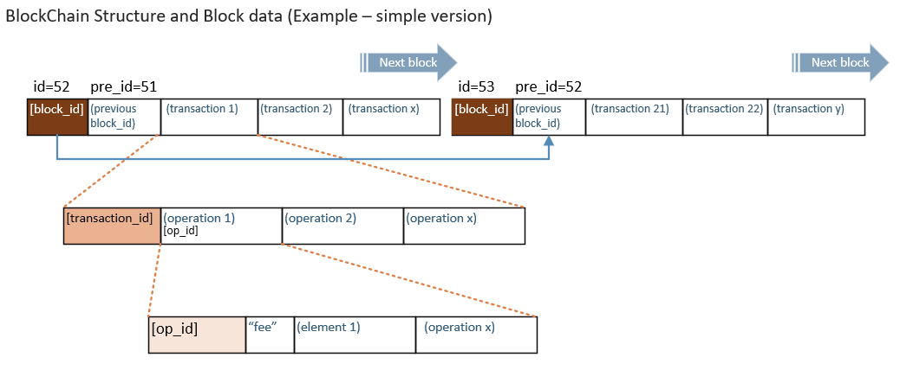

# Components Structures and Descriptions

#### Table of Contents:
- **Block**
  - [A Block Elements and Structure: simple version](README.md#block)  
- **Block Headers** - inheritance (objects)
  - [Block Header](README.md#block-header---inheritance)
- **Protocols**
  - [Protocols' Components and Descriptions](../components/lib_protocols.md#bitshares-core---graphenechain)
- **Evaluators**
  - graphene::chain::account_create_evaluator (*coming soon*)
- **Operations** : BitShares available operations details and the object structures.
  - [Operations and Detailed Descriptions](../components/operations.md#bitshares-core---graphenechain) 
- **Objects**
  - [Object Names and Detailed Descriptions](../components/objects.md#object-names-and-detailed-descriptions)

***

## Block 
The below is simple blockchain structure image. 
- Each block has a block_id and refers a previous block_id. And each block has more than one transaction(s). 
- Each transaction has more than one operation(s). 
- Each operation has "fee" and element(s). Each operation has different elements (processes). 



  - [A Block Elements and Structure: simple version(PDF)](../knowledge_base/shared_files/structures/block_structure_sv1.pdf)
  - [A Block Elements and Structure (PDF)](../knowledge_base/shared_files/structures/BitShares-Block-Structurev1.pdf)
  
  
## Block Header - inheritance 

#### block_header

```
// *Block Header Inheritance* (i.e.) 1.0.0.0 
// graphene::chain

struct block_header
{
    digest_type         digest()const;
    block_id_type       previous;
    uint32_t            block_num()const { return num_from_id(previous) + 1; }
    fc::time_point_sec  timestamp;
    witness_id_type     witness;
    checksum_type       transaction_merkle_root;
    extensions_type     extensions;

    static uint32_t     num_from_id(const block_id_type& id);
};
```
- Note: when we need to add data to `extensions`, remember to review `database::_generate_block()`.
  - More info in https://github.com/bitshares/bitshares-core/issues/1136
      
#### signed_block_header
``` 
// *Block Header Inheritance* (i.e.) 1.1.0.0
// graphene::chain

struct signed_block_header : public block_header
{
    block_id_type        id()const;
    fc::ecc::public_key  signee()const;
    void                 sign( const fc::ecc::private_key& signer );
    bool                 validate_signee( const fc::ecc::public_key& expected_signee )const;

    signature_type       witness_signature;
};
``` 
#### signed_block
``` 
// *Block Header Inheritance* (i.e.) 1.1.1.0
// graphene::chain

struct signed_block : public signed_block_header
{
    checksum_type                 calculate_merkle_root()const;
    vector<processed_transaction> transactions;
};
```
 
#### signed_block_with_info
```  
// *Block Header Inheritance* (i.e.) 1.1.1.1
// graphene::wallet

struct signed_block_with_info : public signed_block
{
    signed_block_with_info( const signed_block& block );
    signed_block_with_info( const signed_block_with_info& block ) = default;

    block_id_type                  block_id;
    public_key_type                signing_key;
    vector< transaction_id_type >  transaction_ids;
};
``` 
 
