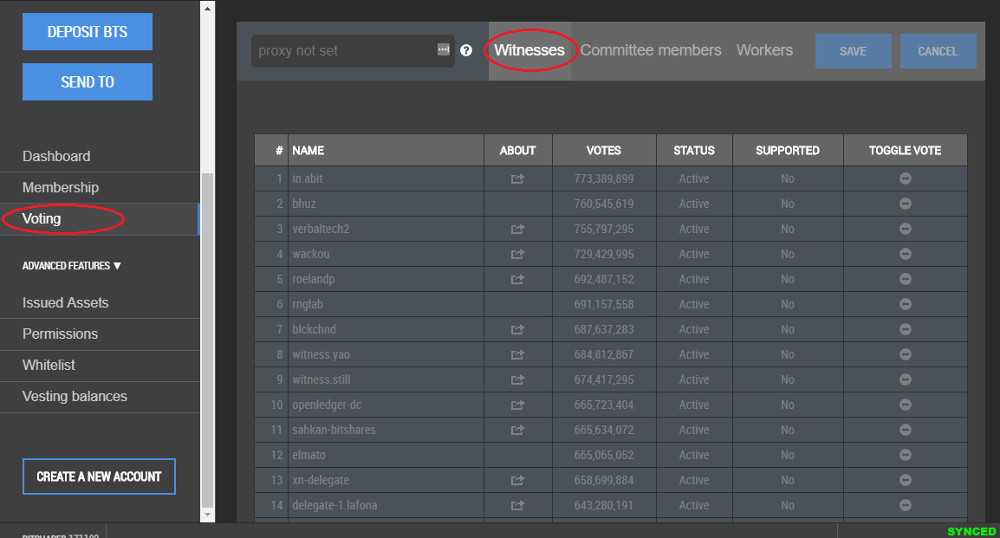
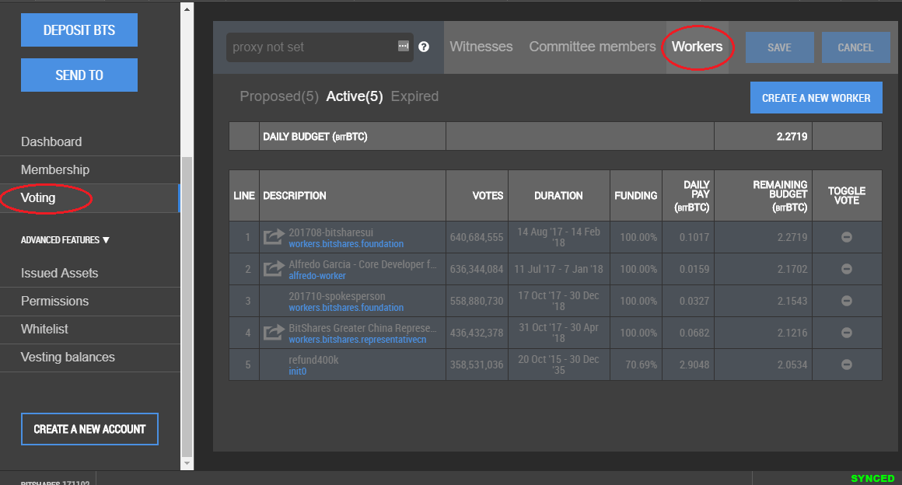

Voting
==================

Voting is important in Bitshares in the same way it is important to the community in which you live. The weight of your vote is directly correlated to the number of BTS you own. If you aren't heavily involved in the community, you are encouraged to choose a proxy who represents your interests.

If you hold some ``BTS`` tokens, you are considered a shareholder of the
BitShares business and thus have a say in where it should be heading in
future. As a shareholder you can cast a vote for three different
entities within the network:

* **Block producers** bundle transactions into blocks and sign them with
  their signing key. These so called *witnesses* keep the blockchain alive by producing one
  block every few seconds and get paid by newly issued BTS shares
  similar to Bitcoin. Their second job is to produce reliable and
  accurate price feeds for the smartcoins.
* **Committee Members** :ref:`govern the blockchain and the business
  parameters <blockchain-governance>`, and define the transaction fees.
* **Workers** are freelancers or businesses that provide a
  non-profitable service for the BitShares ecosystem. Essentially, they
  apply for a job in the ecosystem by providing actual work and get paid
  accordingly (if the shareholders approve).

Since voting might be a too time-consuming task for many shareholders,
BitShares offers them a way to delegate their voting power to so called
**proxies**. The sole purpose of proxies is to follow the ecosystem and
be vote according to their *followers*. This is similar to many
political votes where citizens vote for representatives which vote on
their behalf.

Proxy
-------

You may choose to not be active in the governance of Bitshares. If this is the case, it's important that you choose someone in the :ref:`Bitshares community <community-members>`  who you identify with and set that entity as your proxy. This gives them to the power to vote on your behalf with your BTS shares backing their vote. This is similar to electing a representative.

|

Casting your vote or setting your proxy is very simply using the user interface (e.g. hosted wallet or light wallet).

Setting a proxy
^^^^^^^^^^^^^^^^^
 
The picture below shows how to set your trusted proxy:

(*--->>> need to be updated)

.. image:: ../bts_user/voting-proxy.png
        :alt: Setting a Proxy
        :width: 650px
        :align: center
	
|

.. _voting:

---------------------------------------------

If you have not set a proxy, you can cast your own vote for witnesses,
committee members or workers and publish your vote as shown in the
picture below.

Voting For...
--------------------

Voting for Witness
^^^^^^^^^^^^^^^^^^^^

|

Voting for Committee Members
^^^^^^^^^^^^^^^^^^^^^^^^^^^^^

.. image:: ../bts_user/voting2.png
        :alt: Voting - Committee Members
        :width: 650px
        :align: center

|

Voting for Workers
^^^^^^^^^^^^^^^^^^^^

		
|
		