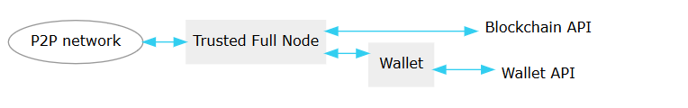
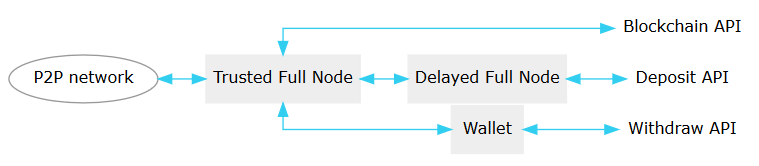

Integration Guide
===================================

.. _how-to-run-full-node:

.. include:: tutorials/full-node-usage.rst  

Network and Wallet Configuration
-----------------------------------------

Similar to other crypto currencies, it is recommended to wait for several
confirmations of a transcation. Even though the consensus scheme of Graphene is
alot more secure than regular proof-of-work or other proof-of-stake schemes, we
still support exchanges that require more confirmations for deposits.

Components
^^^^^^^^^^^^^^^^

P2P network
~~~~~~~~~~~~~~~~~~

The BitShares client uses a peer-to-peer network to connect and broadcasts
transactions there. A block producing full node will eventually catch your
transcaction and validates it by adding it into a new block.

Trusted Full Node
~~~~~~~~~~~~~~~~~~~~
We will use a Full node to connect to the network directly. We call it
*trusted* since it is supposed to be under our control.

Wallet
~~~~~~~~~~~~~~~
The wallet is used to initiate transfers (customer withdrawals) and
connects to the trusted full node.

Wallet API
~~~~~~~~~~~~
Since we have a delayed full node that we can fully trust, we will interface
with this node to query the blockchain and receive notifications from it one
balance changes. Hence, we use this API to watch deposits of users into the
exchange's account. Because the delayed node only knows about irreversible
blocks all transactions are at this point irreversible as well. For customer withdrawals, we will interface with the wallet to initiate
transfers to the accounts of the customers on request. As we are connected to
the trusted node directly, there will not be any delay on withdrawals.

Network Setups
^^^^^^^^^^^^^^^^^^^

General Setup
~~~~~~~~~~~~~~

For general purpose setups, we recommend a reduced complexity setup that
looks as follos

A guide to setup this network can be found here: General Network and Wallet Configuration

.. _high-security-setup:

High Security Setup
~~~~~~~~~~~~~~~~~~~~~

For high security, we provide a so called *delayed* full node which
accepts the parameter ``trusted-node`` for an RPC endpoint of a trusted
validating node.  The trusted-node is a regular full node directly
connected to the P2P network that works as a proxy. The delayed node
will delay blocks until they are **irreversible**. Depending on the
block interval and the number of witnesses, this may lead to a few
minutes of delay.

A guide to setup this network can be found here: High Security Network and Wallet Configuration

.. _general-network-setup:

.. include:: general-network-setup.rst

.. _high-security-network-setup:

.. include:: secure-network-setup.rst

      
.. _monitoring-account-deposits-python:
   
.. include:: tutorials/python-monitor.rst

.. _nodejs-example:

.. include:: tutorials/nodejs-monitor.rst

Python Module for the DEX / General Python Library
-----------------------------------------------------------
   
pybitshares.com (http://docs.pybitshares.com/en/latest/) offers a Trading module specifically for the decentralized exchange (DEX). It is well documented and has it’s own documentation page.
   
|

