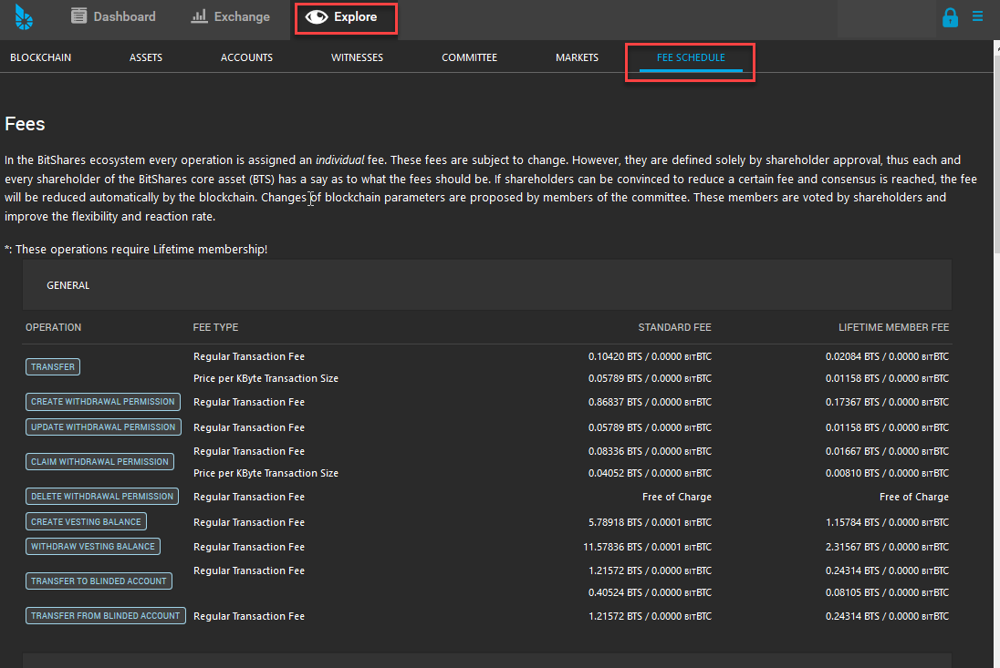
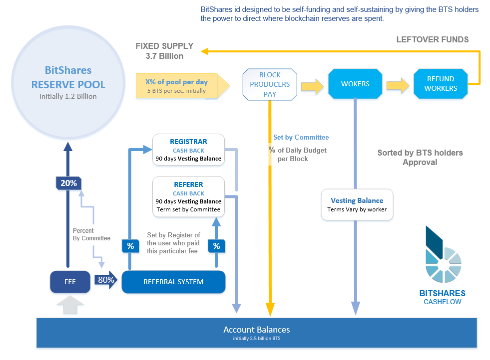

.. _bts-fees:

Fees
======

In the BitShares Blockchain Network, every operation is assigned an individual fee. Each operation has different transaction fee. You can check each operation fee schedule if you are interested. 

.. contents:: Table of Contents

-----------

Fee Types
-------------

There are different Transaction Fee Types. And each operation has own transaction fee amount. Some operations ask Regular Transaction Fee and Price of per KByte Transaction Size. 

For instance, *Transfer operation* asks both (Regular Transaction Fee and Price of per KByte Transaction Size) fees. The *Price per KByte Transaction Size* comes from a size of memo you send. The memo is encrypted by default and can only be decrypted by the participants of the transfer. It's safe to use to sens a message. However, the transfer fee depends on the length of the memo.

You can use the memo section to send a message. Also, some transactions require you to input a necessary information in the memo section. Be sure if you put each information in a correct place before you confirm your transaction! 

- **Fee Types**

  - Regular Transaction Fee
  - Price per KByte Transaction Size
  - Symbols with 3 Characters (Create Asset Operation)
  - Symbols with 4 Characters (Create Asset Operation)
  - Longer Symbols (Create Asset Operation)
  - Basic Fee (Create Account)
  - Fee for Premium Names (Create Account)
  - (Lifetime Membership Fee)
 
- **Fee Schedules** 

  - You can find `each Operation Fee List here. <https://wallet.bitshares.org/#/explorer/fees>`_

**Example: Fee Schedule View**
  

		
Paying Fees
^^^^^^^^^^^^^^^^

Each time you perform an activity (i.e., send fund, place an order, etc), you pay a smell amount of fee. Any transaction fee can be paid by paying any asset that has a Core exchange rate (i.e., price) at which the asset can be exchange implicitly into BTS to cover the network fee. When you confirm your activity (transaction), you can see a fee amount for the transaction.
   

Order Cancellation 
^^^^^^^^^^^^^^^^

If you cancel an order that has not been fully or partially filled, 90% of the fee will be payed back to your account. However, this cashback will be in BTS (CORE token) and not in the asset you have originally paid the fee in. 

|

-----------------

Standard Fee and Lifetime Membership Fee
-----------------------------------------

Your transaction fees depend on your membership status. If you are a Basic Member, you pay "Standard Fee". And if you are a Lifetime Member, you pay "Lifetime Member Fee". 

**20%** of each transaction fee goes to the network. And if you are a **Lifetime Members, you get cashback of 80% of the fee** you payed.
 
	 
For many cases it may make sense to upgrade the account even though you don’t want to participate in marketing at all simply for the reasons to get a cashback of 80% of the fees you pay for your own transactions!

.. Note:: Technically, the fees that you pay stay the same, but a part of the fees is refunded in the form of a **vesting balance**. Once the fees have vested you can withdraw them. 

|

--------------

Asset Creation Fee
---------------------------

We talked about "Transfer Operation" Fees. Some of the transfer fees depend on the length of the memo. Similarly, an **Asset Creation Fee** depends on the length of your asset symbol. **Three (3) Character Symbols** are the shortest and are rather expensive while symbols with **five (5) or more characters** are significantly cheaper.

**50%** of the asset creation fee is used to pre-fill the assets fee pool. From the other **50%**, **20% go to the network and 80% go to the referral program**. This means that if you are a lifetime member, you get back 40% of the asset creation fee after the vesting period (currently 90 days).

How to Profit by Issuing an Asset
^^^^^^^^^^^^^^^^^^^^^^^^^^^^^^^^^^^^^^^^^^^^^^^^

There are many ways to profit from issuing an asset. As the issuer you have complete control over market fees and can tune parameters such as the percent of each trade that is collected as a fee. This percentage can be bounded by a minimum and maximum fee. The combination of these three parameters give issuers great flexibility in pricing.

Fee Pools
^^^^^^^^^^^^^^^^^

Issuers may optionally maintain a Fee Pool. The **Fee Pool is a pool of BTS** and an exchange rate at which the issued asset may be converted into BTS. When a user wishes to pay a network fee with the asset, the fee pool will step in to convert the asset into BTS at the rate that the issuer has specified. This means that issuers may charge a premium every time users opt to use their asset to pay network fees rather than paying them directly with BTS.

.. note:: The purpose of the fee pool is **to provide a convenience to users that would like to use an asset without concerning themselves with the details of acquiring BTS**. Anyone may fund the fee pool, but only the issuer may specify the exchange rate. This exchange rate is automatically set to the settlement price if the asset is collateralized by BTS.

If the assets fee pool is funded, the fees can be payed in the native UIA instead of BTS.

BitShares Reserve Pool and Cashflow 
^^^^^^^^^^^^^^^^^^^^^^^^^^^^^^^^^^^^^^^

		
|		