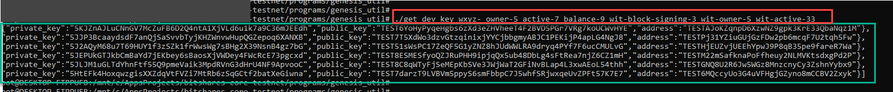

.. _how-to-get-key-pairs:

How to Generate Key Pairs
==========================

This section provides instructions for generating public and private key pairs. 

.. contents:: Table of Contents
   :local:
   
-------

.. Note:: For generating example outputs, we used the BitShares Public Testnet environment (download **testnet branch** and build the ``wetness_node`` and ``cli_wallet`` programs). Therefore, each public key starts "TEST...". If you try the same command lines in the Mainnet environment, you will get each private key starts "BTS...".  This will happen automatically, if you use the options by the programs from the correct branch.

|

suggest_brain_key 
----------------------------------------------

Use this function for production. 

**Example**

::

	$ programs/cli_wallet/cli_wallet --suggest_brain_key
	{
	  "brain_priv_key": "AUTARKY BOUDOIR RESOAK IFE KEEPING SLA SERAIL UROSIS OUTWALK PIERCER WOKE MOHO YEAROCK APRAXIA UNREADY AMNIC",
	  "wif_priv_key": "5JATtPJEFQXRqDwVeTWHBk1UuuRmfXDYTtUwfuerE6VncFT6HX8",
	  "pub_key": "TEST6LiMuZQxJpeGB7TuRDfqCwwXws3aieZwyC3S1hq5SbPVLFEbbf"
	}

	
* wif_priv_key : private key
* pub_key : public key	
	
|

-----------------

get_dev_key 
----------------------------------------------

Use this function for testing purpose. 
This ``get_dev_key`` function can generate more than one key pairs at the same time in one command line. The function is simply combine the prefix with all given suffixes, compute a hash over each combination, and use that hash as a private key, from which the matching public key and address are generated.

::
 
	// checking Help -- ./get_dev_key --help

	../bitshares-testnet/programs/genesis_util# ./get_dev_key --help

	This program generates keys with specified prefix and suffix(es) as seed(s).

	Syntax:

	  get_dev_key <prefix> <suffix> ...

	Examples:

	  get_dev_key nath an
	  get_dev_key wxyz- owner-5 active-7 balance-9 wit-block-signing-3 wit-owner-5 wit-active-33
	  get_dev_key wxyz- wit-block-signing-0:101

  

**Example**

::
	
	// command line(1):  ./get_dev_key TEST testkey1 testkey2 testkey3 testkey4 testkey5
	
	.../bitshares-testnet/programs/genesis_util# ./get_dev_key TEST testkey1 testkey2 testkey3 testkey4 testkey5
	[{"private_key":"5HtmkHtjSFmimjoFW96CWbdE12QWKYkqv1EDY5GSPKj7gaKgL1W","public_key":"TEST5wXFqFYzCsGLPagLbuh2e6kiUi91tGvyCfz76Q3aNJ63xMVza1","address":"TESTHZhCbRvo3rjEXMbL4JoKi49ThVpXpwp21"},
	{"private_key":"5JUE1x9nbRSKAEr38GG7dKtsQGDSYMWAyZxtkydTCzooRRYyQTq","public_key":"TEST7pqhvduRogShfBwwtcD7trFaCbT5eHpNN2AYCAUHtbCVCB6yys","address":"TESTNELqgKWgbPpwwfszNeY4iY5dRvxra5Qji"},
	{"private_key":"5KLrir6U8JbtC7u65fekaznfztJxR9zoTq3wgGmTQsr46HdMoLH","public_key":"TEST7bxKinMaZZH7Z6Bcs4yVMCasfVMJ3CGCNiKLvKcKGLFmGdoEUF","address":"TESTVaUZWAZiYBw52kJZ3KJnhPkeDGz9dy7M"},
	{"private_key":"5K4AtJkfXbpP6VLoBSq9hZEfYc85hDGxMrhC19DWcwUC3YJNFnx","public_key":"TEST77e2JK5pmgGbhKwy45uDaSwCcq86eWDPc7cepFxfVBbViWUgy8","address":"TEST71H99xQQcxHXHAFoWgYTdyKHz9FG2Pc6W"},
	{"private_key":"5JSQetLWRHzrxQNzWH1k7pZwmMUyHDhc9ZAJM45QFDhX1cPu4JB","public_key":"TEST8BTeSAEAw9CdGALBew3Fm2Sf2mGxs2AdnQj2mSJZsULWTHa5oc","address":"TESTEFWJw8Ztnssmyjpj84b9WEHvGRjSa1AS5"}]
	 
	// command line(2):  ./get_dev_key wxyz- owner-5 active-7 balance-9 wit-block-signing-3 wit-owner-5 wit-active-33
	
	.../bitshares-testnet/programs/genesis_util# ./get_dev_key wxyz- owner-5 active-7 balance-9 wit-block-signing-3 wit-owner-5 wit-active-33
	[{"private_key":"5KJZnAJLuCNnGV7McZuFB6D2Q4ntA1XjVLd6u1k7a9C36mJEEdh","public_key":"TEST6YoHyPyqeHgbs6zXd3eZHVheeT4F2BVD5PGr7VRg7koUCWvHYE","address":"TESTAJoKZqnpD6XzwNZ9gpk3KrE33QbaNqz1M"},
	{"private_key":"5JJP3BcaaydsdF7anQjSaSvvbTyjKHZWnvwHupQGZepoq6XANXB","public_key":"TEST7T5XdWo3dzvGtzqinixjYYCjbbgmyABJC1PEKijP4apLG4NgJ8","address":"TESTPj31YZiuGUjGzFDw2pb6mcqF7U2tqh5Fw"},
	{"private_key":"5J2AQyM68u7T69HUY1f3zSZk1frWwsWg7sBHg2X39NsnB4gz7bG","public_key":"TEST51sWsPC17ZeQF5G1yZNZ8hJUdWWLRA9dryq4PYf7F6ucCMULvG","address":"TESTHjEUZvjUEEhYpwJ9P8qB35pe9fareR7Wa"},
	{"private_key":"5JEPUkGTJkbCmBaYd7jEKbey6sBaosXjVWDey4FWcRcE73pgcxd","public_key":"TEST8ESMESfyoQZJRuPHH9ipjqQx5ub48DbLg4sFtRea7njZ6CZ1mH","address":"TESTM22mSafknaPoFfheuy2NLMVKtsdxgPd2P"},
	{"private_key":"5JLJM1uGLTdYhnFtf55Q9pmeVaik3MpdRVnG3dHrU4NF9ApvooC","public_key":"TEST8C8qWTyFjSeMEpKbSVe3JWjWaT2GFiNvBLap4L3xwAEoL54thh","address":"TESTGNQ8U2R6Jw5WGz8MnzcnyCy3ZshnYybx9"},
	{"private_key":"5HtEFk4HoxqwzgisXXZdqVtFVZi7MtRb6zSqGCtf2batXeGiwna","public_key":"TEST7darzT9LVBVm5ppyS6smFbbpC7J5whfSRjwxqeUvZPFt57K7E7","address":"TEST6MQccyUo3G4uVFHgjGZyno8mCCBV2Zxyk"}]
 
 
 
**Sample Output**

		
		
|

--------------------
		
