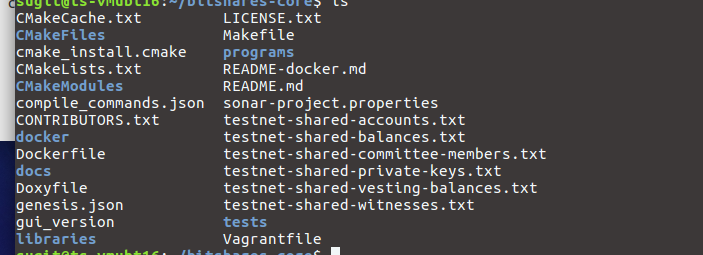

.. _afteriinstall:

Installed BitShares-Core Directory
===================================

In this section, we show you the installed **bitshares-core** folder structure and explain several points of files in the folder. After we examined the installed folder, we test and run two programs (cli_wallet and witness_node).
 

.. contents:: Table of Contents
   :local:
   
-----------------
   

Installed Folders and Files 
-------------------------------

BitShares-Core folder
^^^^^^^^^^^^^^^^^^^^^^^^

After the BitShares-Core installation, you would have a bitShares-core folder and other directories and files inside the bitShares-core folder similar like the below. There is a programs folder that includes a cli_wallet program and a witness_node program. 

		
|
		
programs folder
~~~~~~~~~~~~~~~~~~~~~~~
In the programs folder, you will find a ``cli_wallet`` and a ``witness_node`` build folders. Each folder includes a program file. 

::

    + [programs]
       + [build_healpers]
       + [cli_wallet]
       + [CMakeFiles]
       + [delay_node]
       + [genesis_util]
       + [js_operation_serializer]
       + [size_checker]
       + [witness_node ]
       + cmake_install.cmake 
       + CMakeList.txt 
       + Makefile

	
|
	
cli_wallet folder
~~~~~~~~~~~~~~~~~~~~~~~
* When you start a cli_wallet, you define a cli_wallet program file with other parameters.
* A wallet.json files does not exist as a default. 
* When you import or register an account, and if you so not have a wallet.json file yet, the wallet.json file is created and saved with new chain_id and other values. (*See an example output :ref:`wallet.json <cli-wallet-json-eg>` )

::

    + [programs]
       + [cli_wallet]
           + [CMakeFiles]
           + cli_wallet  (*Program file*)
           + main.cpp
           + wallet.json  (*Not exists after the initial installation*)
           + ...

|

witness_node folder 	
~~~~~~~~~~~~~~~~~~~~~~~
* When you start a witness_node, you define the witness_node program file with other parameters.
* As a default, a witness_node_data_dir does not exist. When you start the witness_node program and if the witness_node_date_dir does not exist, the folder and inside files will be created.
* The witness_node_date_dir (i.e., database folder) includes a :ref:`config.ini <bts-config-ini-eg>` file. There are parameters you can set values to run the witness_node. We recommend you to examine the configuration items. 

::

    + [programs]
       + [witness_node]
          + [CMakeFiles]
          + [witness_node_data_dir] (*Not exists after the initial installation*)
              + [blockchain]
                + [database]
				   + [block_num_to_block]
                + [object_database]                
                + db_version
              + [logs]
                 + [default]
                 + [p2p]
                 + [rpc]
              + [p2p]
                 + peers.json
              + config.ini 
              + logging.ini  
          + witness_node  (*Program file*)
          + main.cpp
          + saltpass.py 
          + ...
			

			
|
		
