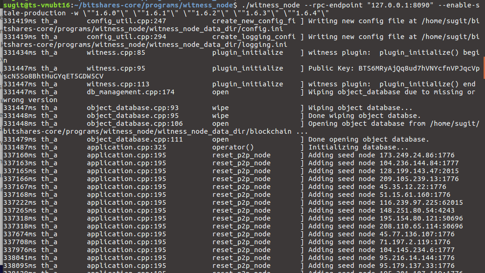
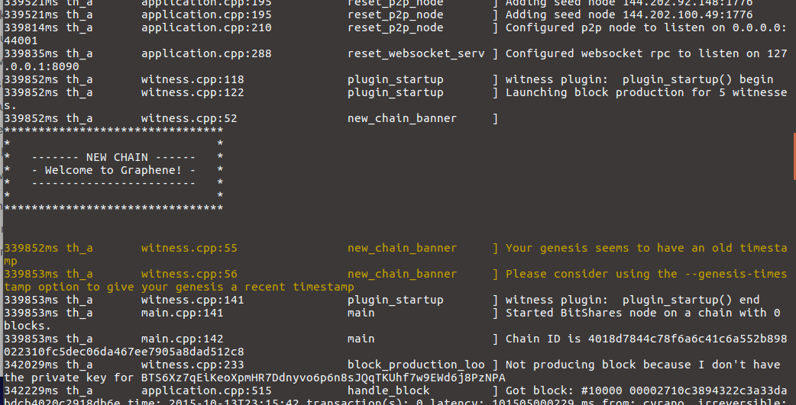
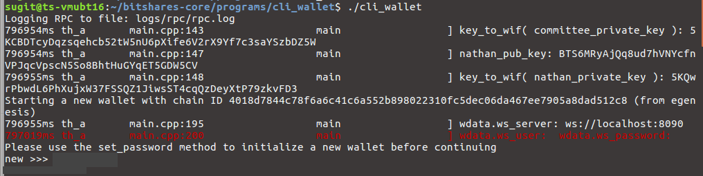

.. _afteriinstall:

Create your Test Local Wallet
===================================

.. contents:: Table of Contents
   :local:
   
-----------------

Create a Test Local Wallet
-------------------------------

We now know what the installed bitshares-core folder contains and how inside folders and files have been structured. In this section, we test running two programs (witness_node and cli_wallet) to examine and get familiar with the BitShares Blockchain data and application program.

Also, we will launch a cli_wallet and import an existing BitShares account and check the balance. Let's start.

**Note: After my initial installation, a database (blocks binary) file size was 306.9MB. And after running a witness_node for several hours, the file size grew to 10GB.**  
   

We assume that you are opening a terminal window and moved (i.e., ``cd bitshares-core``) to the bitshares-core folder. 

1.  Run a Test Local Network 
^^^^^^^^^^^^^^^^^^^^^^^^^^^^^^^^^^
Right now, there is no public testnet, so the only way to test is to run your own private network. To do this, launch a witness_node to generate blocks. 

**1-1. Move to a witness_node folder**
  
.. code-block:: cpp 

	cd programs/witness_node
	
	
.. note:: If you have previously run a witness node, you may need to remove the old blockchain. (at this  early stage, new commits often make it impossible to reuse an old database.)
    ``rm -r witness_node_data_dir``
	
	
**1-2. Run a witness_node in your local (private) network**
  
.. code-block:: cpp 
	
	./witness_node --rpc-endpoint "127.0.0.1:8090" --enable-stale-production -w \""1.6.0"\" \""1.6.1"\" \""1.6.2"\" \""1.6.3"\" \""1.6.4"\"

The initial genesis state has ten pre-configured delegates (1.6.0-9) that all use the same private key to sign their blocks, and the witness_node has the private keys for these initial delegates built in. Launching ``witness_node`` this way allows you to act as all ten delegates.

|

2. Launch a Test Local Wallet 
^^^^^^^^^^^^^^^^^^^^^^^^^^^^^^^^^^

Now, open a **second** terminal window, launch a ``cli_wallet`` program to interact with the network.

**2-1. Move to a cli_wallet folder**
  
.. code-block:: cpp 

	cd programs/cli_wallet
	
	
	
.. note:: Similarly, if you have previously run a wallet, you may need to wipe out your old wallet. 
	 ``rm wallet.json``
	

**2-2. Launch a cli_wallet**	

.. code-block:: cpp 
	
	./cli_wallet

	
If you launch the cli_wallet successfully, you will see ``new >>>`` to the end. 

|
  	
3. Unlock a wallet 
^^^^^^^^^^^^^^^^^^^^^^^^^^^^^^^^^^
	
Before doing anything with the new wallet, set a password ``set_password`` and unlock ``unlock`` the wallet.

.. DANGER:: Your passwords will be displayed on the screen!!

**3-1. Set a wallet password**

.. code-block:: cpp 

	new >>> set_password my_password

	
**3-2. Unlock the wallet** 

.. code-block:: cpp 
	
	locked >>> unlock my_password
	
	unlocked >>>
		

.. tip:: 
  After this point, you can issue any command available to the cli-wallet (:ref:`Wallet APIs <wallet-api-calls>`) or construct your own transaction manually.

  - If you have already a BitShares account, you can look up the account balance information. For example,
      unlocked >>> ``list_account_balances your-account-name`` 
  - If you want to get more detailed information, use **gethelp()**. For example,
      unlocked >> ``gethelp "list_account_balances"``
 
		
		
.. note:: (At this moment) Next step. Please refer, after :ref:`"3.Unlock the Cli_Wallet" <3-unlock-cli-wallet>` section. 

|

----------------

Example Outputs
-------------------------------

Run Local witness node
^^^^^^^^^^^^^^^^^^^^^^^^^^^

The below shows a process after started running..

.. code-block:: cpp 
	
	./witness_node --rpc-endpoint "127.0.0.1:8090" --enable-stale-production -w \""1.6.0"\" \""1.6.1"\" \""1.6.2"\" \""1.6.3"\" \""1.6.4"\"

	

		

		
Run cli wallet
^^^^^^^^^^^^^^^^^^^^^^^^		
The below shows a process after started running..

.. code-block:: cpp 
	
	./cli_wallet
	

- In the process, ``.._pub_key`` and ``key_to_wif`` values are from a config.ini file. 

	

		
		
.. tip:: The chain ID is a hash of the genesis state. All transaction signatures are only valid for a single chain ID. So editing the genesis file will change your chain ID, and make you unable to sync with all existing chains (unless one of them has exactly the same genesis file you do).
		
		
|

