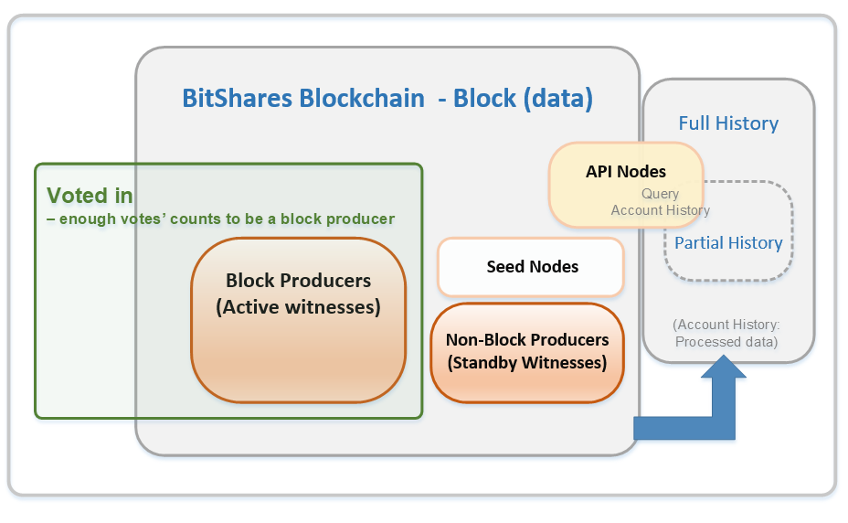

.. _how-to-run-full-node:

****************************
Nodes  
****************************

.. contents:: Table of Contents
   :local:

--------------------

Type of Nodes
==========================

In the BitShares blockchain network, you might find the slightly different naming of **nodes**, such as a full node, witness node, or block producer.  Basically, nodes are keeping all transactions (histories) that have occurred on the blockchain and maintaining the integrity of a blockchain.  A **full node** has every single block that has ever been created on the blockchain. 

In BitShares blockchain network, a **witness node** is a full node, and each witness validates a transaction and broadcasts it. Witnesses nodes provide the complete history and preserve it as a failsafe. 

**API nodes** do not need to have all blockchain histories. They might contain partial blockchain histories.  (Public) API nodes provide essential services without having all blockchain history data (i.e., accept API calls and query the data on witness nodes blockchain). 

**Seed nodes** are the first nodes of the network that accept incoming P2P connection. Also, a seed node can be an API node. In BitShares, its address is hard coded in the program, so when a new node starts, it will connect to the seed nodes by default. Every node (including seed nodes) tells the connected nodes where other nodes are, so all nodes can connect to each other.  


So, when and who producing blocks?  We call **Block Producers** ; they serve an important role of validating signatures and timestamping transactions by including them in a block and broadcast it.  Block Producers are witnesses who got enough votes to become **active witnesses** and can produce a block when they got their turn "time slot".  

Each time, block producers produce a block, they get paid for their services. Their pay rate is set by the BTS holders via their elected committee members. If failing to produce a block in a time slot, then the block producer is not paid.  Currently, BitShares blockchain has 27 Block Producers (Active Witnesses).  You can find BitShares Blockchain witnesses in BitShares UI wallet  Explorer-witnesses, or :ref:`other Explorers <trx-performance-explorer>`.


You could think about BitShares blockchain nodes like the below. 

* Node Types

  - **API Nodes** (i.e., nodes with an open RPC port)

    - Nodes with Full History (a.k.a. full nodes)
    - Nodes with Partial History 	
  - **Seed Nodes** (i.e., nodes with an open P2P port) 
  - **Block Producing Nodes**
  
    - Block Producer or Active Witness Node (belongs to a voted-in witness and is configured with correct key)
    - Standby Witness Node (either a not-voted-in witness, or a voted-in witness with different key)




		
After proper BitShares-Core release installed, each type node is implemented by the same executable, however, each node would need to set up different configurations to start the node. 

For example; although a block producing node can have full history, that would be a waste of resources. Block producing nodes *should* run with minimal plugins (i.e., only witness_plugin). Also, Block producing nodes should not have open network ports.

 
We strongly recommend all node service providers to run and maintain their own nodes for reliability and security reasons.

|

---------------

.. _system-requirements-node:

System Requirements
==========================

.. Attention:: **IMPORTANT:** By default the witness node will start in reduced memory mode by using some of the commands detailed in :ref:`Memory reduction for nodes <memory-nodes>`.
In order to run a full node with all the account history you need to remove ``partial-operations`` and ``max-ops-per-account`` from your config file. Please note that currently(2018-10-17) a full node will need more than 160GB of RAM to operate and required memory is growing fast. Consider the following table as minimal requirements before running a node:


+-------------------+--------------------+-----------------+-------------------+
|    Default        |    Full            |     Minimal     | ElasticSearch     |
+===================+====================+=================+===================+
| 100G SSD, 16G RAM | 200G SSD, 120G RAM | 80G SSD, 8G RAM | 500G SSD, 32G RAM |
+-------------------+--------------------+-----------------+-------------------+


|

---------------

Launch a Node
===============

How to launch the full node::

    ./programs/witness_node/witness_node

It takes an optional –data-dir parameter to define a working and data directory to store the configuration, blockchain and local databases (defaults to `witness_node_data_dir`). Those will be automatically created with default settings if they don’t exist locally set.


.. node-config-example:

.. include:: node_config_example.rst 


|

---------------


Enable Remote Procedure Calls
================================

In order to allow RPC calls for blockchain operations you need to modify the following entry in the configuration file::

    rpc-endpoint = 0.0.0.0:8090

This will open the **port 8090 for global queries only**. Since the witness node only maintains the blockchain and (unless you are an actively block producing witness) no private keys are involved, it is safe to expose your witness to the internet.


* :ref:`How to Run and Use a Full Node <how-to-run-full-node2>`

Although you would get default parameters in your config file for better memory reduction, you might want to learn about the plugin.

* :ref:`Memory Reduction for Nodes: <memory-nodes>`

  - Help to reduce RAM usage significantly by using witness_node executable options 

.. note:: More information about :ref:`how to manage Witness(Full) Node <witness-node-guide-tutorials>`,    in our tutorials. 

|

---------------


Restart the Witness Node
=================================

When restarting the witness node, it may be required to append the ``--replay-blockchain`` parameter to regenerate the local (in-memory) blockchain state. 

.. tip:: If you want to close the Witness Node in a clean way, use ``Ctrl-C`` in Windows.


|

---------------
	
Public Full Node Information 
==============================

* Here is the latest list of `BitShares Public Full Nodes (apiConfig) <https://github.com/bitshares/bitshares-ui/blob/staging/app/api/apiConfig.js>`_


|

---------------

 
.. _api-node-wss-con:

API Node Secure Web Socket Connection
========================================

.. Tip:: How can a Let's Encrypt certificate be used with an API node to provide a secure web socket (wss) connection.

  - This can be done with two steps

    1. Concatenate the fullchain.pem with the privkey.pem --  ``cat fullchain.pem privkey.pem > combined.pem```

    2. In the node's configuration file, point the TLS certificate to combined.pem, and leave the TLS certificate password as blank.

 
 
 

|

|

