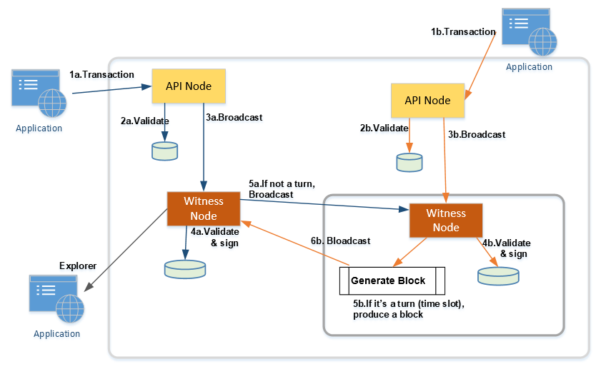

.. _ex-broadcase_trnx:

Features: Broadcast and Transactions 
******************************************

.. contents:: Table of Contents
   :local:
   
-------

Clients and BitShares blockchain network
========================================

In this section, we look into BitShares Blockchain transaction and the flow. The below image is simplified clients and nodes relations. And it shows two transactions occurred and nodes received the transactions. 

On the BitShares blockchain, every node receives a transaction (1a&1b), locally validates its content and signature(2a&2b), and re-broadcasts to its connected peers(3a&3b). The connected peers could be another API node or witness node. 

Block producer nodes (a.k.a. witness nodes) will sign blocks if it is their turn (time slot), produce a block(5b), and broadcast(6b) that block to its connected peers.

If other nodes receive that block, they attempt it to make their copy of the blockchain.

Block producing nodes provide the blockchain with signed (like to think about it as "certified") blocks containing all new data that is previously submitted by account holders through API nodes.

Witnesses are selected based upon their commitment to remain neutral to blockchain policy.  Image, for extremely important contracts, a public notify is sometimes used. Neither witnesses nor notaries are party to the contract, but they serve a very important role of certifying the the contract was signed by the specified individuals at the specifies time. 

In BitShares witnesses serve a similar role of validating signatures and time-stamping transactions by including them in blocks. 

|

--------------

Broadcast transaction methods
==============================

Network_bloadcast_api has methods to broadcast transactions. Those methods are `broadcast_transaction` and `broadcast_transaction_with_callback`. 

:broadcase_transaction:  Broadcast a transaction to the network. The transaction will be checked for **validity in the local database prior to broadcasting**. If it fails to apply locally, an error will be thrown and the transaction will not be broadcast. 

.. code-block:: cpp 

    void network_broadcast_api::broadcast_transaction(const signed_transaction& trx)
    {
       trx.validate();
       _app.chain_database()->push_transaction(trx);
       if( _app.p2p_node() != nullptr )
          _app.p2p_node()->broadcast_transaction(trx);
    }

	
:broadcast_transaction_with_callback:  This version of broadcast transaction registers a callback method that will be called when the transaction is included into a block. The callback method includes the transaction id, block number, and transaction number in the block. 

.. code-block:: cpp 
	
    void network_broadcast_api::broadcast_transaction_with_callback(confirmation_callback cb, const signed_transaction& trx)
    {
       trx.validate();
       _callbacks[trx.id()] = cb;
       _app.chain_database()->push_transaction(trx);
       if( _app.p2p_node() != nullptr )
          _app.p2p_node()->broadcast_transaction(trx);
    }
	
	
|

Example implementations of broadcast transaction 
-------------------------------------------------

In a Wallet plugin, we can find many methods that use broadcast_transaction. There are example implementation patterns we can see and learn from. The below are the examples. 
 
Pattern (1)
^^^^^^^^^^^^^^^^^^^^^

.. code-block:: cpp 

   .......
	signed_transaction trx;
	trx.operations = {op};
	set_operation_fees( trx, _remote_db->get_global_properties().parameters.current_fees);
	trx.validate();

	return sign_transaction(trx, broadcast);

Before the end of method; 

  1. ``signed_transaction`` instance is created
  2. Set an operation
  3. Set ``set_operation_fee``
  4. validate the instance

and use ``sign_transaction`` with the instance and broadcast flag to get a return.
  
	

:signed_transaction sign_transaction: 	Given a fully-formed transaction that is only lacking signatures, this signs the transaction with the necessary keys and optionally broadcasts the transaction.

  -	@param tx the unsigned transaction
  -	@param broadcast true if you wish to broadcast the transaction
  -	@return the signed version of the transaction

* Other methods that have the same pattern (wallet.cpp)
	
  - transfer_to_blind	
  - propose_builder_transaction	
  - propose_builder_transaction2
  - upgrade_account
  - create_asset
  - update_asset
  - update_asset_issuer
  - update_bitasset
  - update_asset_feed_producers
  - publish_asset_feed
  - fund_asset_fee_pool
  - claim_asset_fee_pool
  - reserve_asset
  - global_settle_asset
  - settle_asset
  - bid_collateral
  - whitelist_account
  - create_committee_member
  - create_witness
  - update_witness
  - create_worker
  - update_worker_votes	
  - withdraw_vesting
  - vote_for_committee_member
  - vote_for_witness
  - set_voting_proxy
  - set_desired_witness_and_committee_member_count
  - sell_asset
  - borrow_asset
  - borrow_asset_ext
  - cancel_order
  - transfer
  - issue_asset
  - propose_parameter_change
  - propose_fee_change
  - approve_proposal

|
	
Pattern (2)
^^^^^^^^^^^^^^^^^^^^^

.. code-block:: cpp 

   signed_transaction tx;
   // do something...
   ..........
   if( broadcast )
 	 _remote_net_broadcast->broadcast_transaction( tx );

   return tx;
   
   
Before the end of method,

  1. ``signed_transaction`` instance is created, 
  2. (do something...)
  3. check `broadcase1` flag 
  4. if broadcast=rue, send the instance by ``broadcast_transaction`` 
  
and return the transaction instance

  
* Other methods that have the same pattern (wallet.cpp)
	
  - register_account	  
  - create_account_with_private_key  
  - sign_transaction
  - blind_transfer_help	  
	  

----

|	
	
	
Transactions and block
==============================

Blocks are produced by witnesses. Each block contain more than one transactions. Each transaction contains more than one operations. And each operation has a "fee" element and other elements. You can find the :ref:`information about block structure here <lib-block>`. 

You can see that each operation has own ``fee_parameter_type`` definition and calculates the fee.  About the "fee" is another big topic. We would like to visit it in another section. 

What is a transaction in BitShares blockchain? Well, you might say "groups operations". That's true also. BitShares blockchain already has implemented about fifty operations. 

Smart contracts in Graphene are one or a group of operations. That means you can use the operations (Smart contracts) for your creations. And if you would like to do more, you can put focus to create new operation and implement it. You can find :ref:`the BitShares blockchain operations list here <lib-operations>`. 

Protocols (transactions)
-------------------------

There are protocols to build up BitShares blockchain components and systems. A protocol is a set of rules. It might be a good idea to know what types of protocols (rules) BitShares blockchain has. 

:transaction: All transactions are sets of operations that must be applied atomically.

  - Transactions must refer to a recent block that defines the context of the operation so that they assert a known binding to the object id’s referenced in the transaction.
  - Ream more :ref:`Protocol: transaction <lib-transaction-anchor>`

:processed_transaction:  It captures the result of evaluating the operations contained in the transaction.  

  - When processing a transaction some operations generate new ``object IDs`` and these IDs cannot be known until the transaction is actually included into a block. 
  - When a block is produced these new ids are captured and included with every transaction. The index in ``operation_results`` should correspond to the same index in operations. If an operation did not create any new ``object IDs`` then ``0`` should be returned.

:proposed_transactions: The Graphene Transaction Proposal Protocol. Graphene allows users to propose a transaction which requires approval of multiple accounts in order to execute.

  - The user proposes a transaction using ``proposal_create_operation``, then signatory accounts use ``proposal_update_operations`` to add or remove their approvals from this operation. When a sufficient number of approvals have been granted, the operations in the proposal are used to create a virtual transaction which is subsequently evaluated. Even if the transaction fails, the proposal will be kept until the expiration time, at which point, if sufficient approval is granted, the transaction will be evaluated a final time. This allows transactions which will not execute successfully until a given time to still be executed through the proposal mechanism. The first time the proposed transaction succeeds, the proposal will be regarded as resolved, and all future updates will be invalid.
  -  The proposal system allows for arbitrarily complex or recursively nested authorities. If a recursive authority (i.e. an authority which requires approval of 'nested' authorities on other accounts) is required for a proposal, then a second proposal can be used to grant the nested authority's approval. That is, a second proposal can be created which, when sufficiently approved, adds the approval of a nested authority to the first proposal. This multiple-proposal scheme can be used to acquire approval for an arbitrarily deep authority tree. 
  - **Note** that at any time, a proposal can be approved in a single transaction if sufficient signatures are available on the ``proposal_update_operation``, as long as the authority tree to approve the proposal does not exceed the maximum recursion depth. In practice, however, it is easier to use proposals to acquire all approvals, as this leverages on-chain notification of all relevant parties that their approval is required. Off-chain multi-signature approval requires some off-chain mechanism for acquiring several signatures on a single transaction. This off-chain synchronization can be avoided using proposals.
  

	  
|

|

