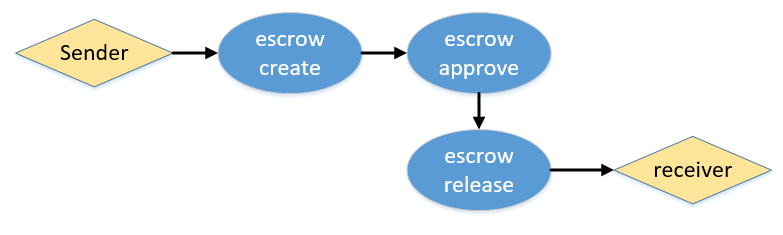
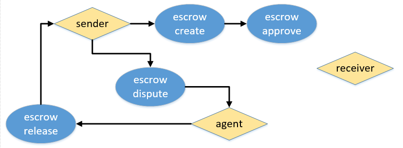
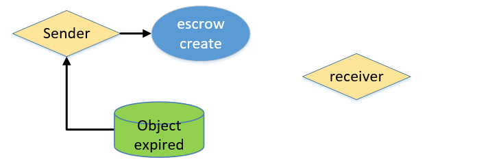
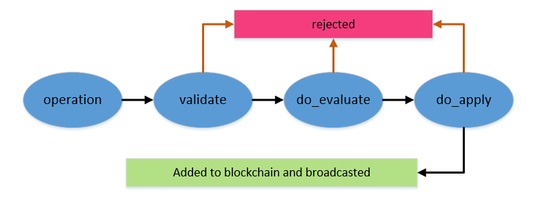

.. _pre-graphene-smart-contract:

***********************
Example: Graphene Smart Contract
***********************

This information was presented by @oxarbitrage (Alfredo Garcia). He explained about Graphene Smart Contracts and the development steps by creating an example of Escrow Smart Contract. In this section, you will learn about what steps to take and what comportments to prepare for the new Graphene escrow smart contract.

.. contents:: Table of Contents
   :local:

-------------

Steps involved in the development of new smart contracts in the Graphene based blockchains.

About Graphene Smart Contracts
=====================================

* Graphene smart contracts are named operations inside the codebase.
* Smart contracts can be one or a group of operations.

  - Example 1: The transfer of asset from one account to another is one operation and a smart contract.
  - Example 2: An escrow smart contract is a group of operations(escrow_create, escrow_approve, escrow_dispute and escrow_release)
  - Example 3: A worker proposal is a smart contract consisting of several operations and make use of the maintence interval to automatically do stuff.
  
* Graphene blockchains as a whole have several things in common.  

Development of new Smart Contracts
=====================================

You would need... 

* C++ skills for BitShares-Core development
* Have your idea and Business Plan
* Consider codebase is different among graphene blockchains.
* Knowledge

  - Make/Cmake.
  - Debian based distribution recommended for development (but not mandatory)

* All block, transactions, DPOS, etc is already handled by the blockchain. Need to focus only in operation creation and implementation

-------------

Sample: Escrow Smart Contract flow
====================================

**Happy Path**

---------------------

**Dispute path**

----------------------

**Expiration path**

		
-----------
		
Development Steps
========================

1. Define your Object
^^^^^^^^^^^^^^^^^^^

.. code-block:: cpp 

	class escrow_object : public graphene::db::abstract_object<escrow_object> {
	public:
	uint32_t                escrow_id; // Number to identify the escrow object
	account_id_type         sender; // Escrow sender
	account_id_type         receiver; // Escrow receiver
	account_id_type         agent; // Trust escrow entity
	asset                   amount; // How many asset to hold on escrow
	time_point_sec          expiration; // When the object will became invalid and deleted
	bool                    receiver_approved = false; // Receiver approve flag
	bool                    agent_approved = false; // Agent approve flag
	bool                    dispute = false; // Dispute flag
	};

|

2. Create Object Index and Search Call
^^^^^^^^^^^^^^^^^^^^^^^^^^^^^^^^^^^^

**Object Index**

.. code-block:: cpp 

	struct by_from_id;
	typedef multi_index_container<
	escrow_object,
	  indexed_by<
		ordered_unique< tag< by_id >, member< object, object_id_type, &object::id > >,
		ordered_unique< tag< by_from_id >,
		 composite_key< escrow_object,
		   member< escrow_object, account_id_type,  &escrow_object::sender >,
		   member< escrow_object, uint32_t, &escrow_object::escrow_id >
		   >
		 >
	   >
	> escrow_object_index_type;
	typedef generic_index< escrow_object, escrow_object_index_type > escrow_index;

	
**Search Calls**

.. code-block:: cpp 

	const escrow_object& database::get_escrow( account_id_type account, uint32_t escrow_id )const 
	{
	   const auto& escrow_idx = get_index_type<escrow_index>().indices().get<by_from_id>();
	   auto itr = escrow_idx.find( boost::make_tuple(account,escrow_id) );
	   FC_ASSERT( itr != escrow_idx.end() );
	   return *itr;
	}

|	

3. Define Operations
^^^^^^^^^^^^^^^^^^^

* Smart contracts in graphene are 1 or a group of operations. 
* In the case of the sample escrow contract we are talking about **four independent operations** that together make the escrow smart contract.

**3a. Escrow Create Operation**

.. code-block:: cpp 
  
	struct escrow_create_operation : public base_operation 
	{
	   uint32_t                escrow_id;
	   account_id_type         sender;
	   account_id_type         receiver;
	   account_id_type         agent;
	   asset                   amount;
	   time_point_sec          expiration;
	   void validate()const;
	};

**3b. Escrow Approve Operation**
  
.. code-block:: cpp 
    
	struct escrow_approve_operation : public base_operation
	{
	   account_id_type         sender;
	   account_id_type         receiver;
	   account_id_type         agent;
	   account_id_type         who; // Who is trying to approve, need to be receiver or agent
	   uint32_t                escrow_id;
	   bool                    approve;
	   void validate()const;
	};

 
**3c. Escrow Dispute Operation**

.. code-block:: cpp 

	struct escrow_dispute_operation : public base_operation 
	{
	   account_id_type         from;
	   account_id_type         to;
	   account_id_type         agent;
	   uint32_t                escrow_id;
	   account_id_type         who;
	   void  validate()const;
	};
		
 
**3d. Escrow Release Operation**
  
.. code-block:: cpp 
		
	struct escrow_release_operation : public base_operation 
	{
	   account_id_type         sender;
	   account_id_type         receiver;
	   account_id_type         agent;
	   account_id_type         who;
	   account_id_type         release_receiver;
	   uint32_t                escrow_id;
	   asset                   amount;
	   void validate()const;
	};

------------------------

|

4. Create Validations
^^^^^^^^^^^^^^^^^^^^^^

.. code-block:: cpp 

	void escrow_transfer_operation::validate()const 
	{
	   FC_ASSERT( amount.amount > 0 );
	   FC_ASSERT( sender != receiver );
	   FC_ASSERT( sender != agent && receiver != agent );   
	}

	void escrow_approve_operation::validate()const 
	{
	   FC_ASSERT( who == sender || who == agent );
	}

	void escrow_dispute_operation::validate()const 
	{
	   FC_ASSERT( who == sender || who == receiver );
	}

	void escrow_release_operation::validate()const 
	{
	   FC_ASSERT( who == sender|| who == receiver|| who == agent);
	   FC_ASSERT( release_receiver == from || release_receiver == to);
	   FC_ASSERT( amount.amount > 0 );
	}

-----------------

|

5. Create Initialize Evaluators and Index
^^^^^^^^^^^^^^^^^^^^^^^^^^^^^^^^^^^^^^^^^^^^

.. code-block:: cpp 

	void 
	database::initialize_evaluators()
	{
	   ...
	   register_evaluator<escrow_create_evaluator>();
	   register_evaluator<escrow_approve_evaluator>();
	   register_evaluator<escrow_dispute_evaluator>();
	   register_evaluator<escrow_release_evaluator>();
	   ...
	}
	void 
	database::initialize_indexes()
	{
	   ...
	   add_index< primary_index< escrow_index > >();
	   ...
	}

--------------------

|

6. Create Evaluators
^^^^^^^^^^^^^^^^^^^^^

* More complex validation is done in ``do_evaluate`` member function.
* Real action is done in ``do_apply``

		
		
**6a. Escrow Create Evaluator**
  
.. code-block:: cpp 

	void_result escrow_create_evaluator::do_evaluate(const escrow_create_operation& o)
	{
	   FC_ASSERT( o.escrow_expiration > db().head_block_time() );
	   FC_ASSERT( db().get_balance( o.sender, o.amount.asset_id ) >= (o.amount) );
	   return void_result();
	}

.. code-block:: cpp 

	object_id_type escrow_transfer_evaluator::do_apply(const escrow_transfer_operation& o)
	{
	   try {
		  db().adjust_balance( o.sender, -o.amount ); // MONEY IS LEAVING THE SENDER ACCOUNT HERE
		  const escrow_object& esc = db().create<escrow_object>([&]( escrow_object& esc ) {
			 esc.escrow_id              = o.escrow_id;
			 esc.sender                 = o.sender;
			 esc.receiver               = o.receiver;
			 esc.agent                  = o.agent;
			 esc.amount                 = o.amount;
			 esc.escrow_expiration      = o.escrow_expiration;  
	   });
	   return  esc.id;
	} 
	FC_CAPTURE_AND_RETHROW( (o) )
	}
	  
	  
**6b. Escrow Approve Evaluator**

.. code-block:: cpp 

	void_result escrow_approve_evaluator::do_evaluate(const escrow_approve_operation& o)
	{
	   const auto& escrow = db().get_escrow( o.sender, o.escrow_id );
	   FC_ASSERT( escrow.to == o.to, "op 'to' does not match escrow 'to'" );
	   FC_ASSERT( escrow.agent == o.agent, "op 'agent' does not match escrow 'agent'" );
	   return void_result();
	}
	  
.. code-block:: cpp 

	void_result escrow_approve_evaluator::do_apply(const escrow_approve_operation& o)
	{
	   try{
		  const auto& escrow = db().get_escrow( o.from, o.escrow_id );
		  bool reject_escrow = !o.approve;
		  if( o.who == o.receiver )
		  {
			 FC_ASSERT( !escrow.receiver_approved, "'receiver' has already approved the escrow" );
			 if( !reject_escrow )
			 {
				db().modify( escrow, [&]( escrow_object& esc )
				{  
				   esc.receiver_approved = true;
				});
			  }
		  }
		  else if( o.who == o.agent )
		  {
			 FC_ASSERT( !escrow.agent_approved, "'agent' has already approved the escrow" );
			 if( !reject_escrow )
			 {
				db().modify( escrow, [&]( escrow_object& esc )
				{
				   esc.agent_approved = true;});
				}
			 }
			 return void_result();
	}
	FC_CAPTURE_AND_RETHROW( (o) );
	}

	  
**6c. Escrow Dispute Evaluator**

.. code-block:: cpp 
	  
	void_result escrow_dispute_evaluator::do_evaluate(const escrow_dispute_operation& o)
	{
	   const auto& e = db().get_escrow( o.sender, o.escrow_id );
	   FC_ASSERT( e.receiver_approved && e.agent_approved, "escrow must be approved by all parties before a dispute can be raised" );
	   FC_ASSERT( !e.disputed , "escrow is already under dispute");
	   FC_ASSERT( e.receiver == o.receiver , "op 'receiver' does not match escrow 'receiver'");
	   FC_ASSERT( e.agent == o.agent, "op 'agent' does not match escrow 'agent'" );
	   return void_result();
	}

.. code-block:: cpp 
	
	void_result escrow_dispute_evaluator::do_apply(const escrow_dispute_operation& o)
	{
	   try 
	   {
		  const auto& e = db().get_escrow( o.sender, o.escrow_id );
		  db().modify( e, [&]( escrow_object& esc ){
			 esc.disputed = true;
		  });
		  return void_result();
	} 
	FC_CAPTURE_AND_RETHROW( (o) );
	}

  
**6d. Escrow Release Evaluator**

.. code-block:: cpp 
	  
	void_result escrow_release_evaluator::do_evaluate(const escrow_release_operation& o)
	{
	   const auto& e = db().get_escrow( o.sender, o.escrow_id );
	   FC_ASSERT( e.amount >= o.amount && e.amount.asset_id == o.amount.asset_id );
	   FC_ASSERT( o.amount.amount > 0 && e.amount.amount > 0);
	   FC_ASSERT( e.to == o.receiver, "op 'receiver' does not match escrow 'receiver'");
	   FC_ASSERT( e.agent == o.agent, "op 'agent' does not match escrow 'agent'" );
	   FC_ASSERT( o.release_receiver == e.sender || o.release_receiver == e.receiver, "Funds must be released to 'sender' or 'receiver'" );
	   FC_ASSERT( e.receiver_approved && e.agent_approved, "Funds cannot be released prior to escrow approval." );  // If there is a dispute regardless of expiration, the agent can release funds to either party
	   if( e.disputed )
	   {
		  FC_ASSERT( o.who == e.agent, "'agent' must release funds for a disputed escrow" );
	   }
	   else
	   {
		  FC_ASSERT( o.who == e.sender || o.who == e.receiver, "Only 'sender and 'receiver' can release from a non-disputed escrow" );
		  if( e.escrow_expiration > db().head_block_time() )
		  {
		  // If there is no dispute and escrow has not expired, either party can release funds to the other.
			 if( o.who == e.sender )
			 {
				FC_ASSERT( o.receiver == e.receiver, "'sender' must release funds to 'receiver'" );
			 }
			 else if( o.who == e.receiver )
			 {
				FC_ASSERT( o.release_receiver == e.sender, "'receiver' must release funds to 'sender'" );
			 }
		  }
		}
		return void_result();
	}

.. code-block:: cpp 
	  
	void_result escrow_release_evaluator::do_apply(const escrow_release_operation& o)
	{
	   try {
		  const auto& e = db().get_escrow( o.sender, o.escrow_id );
		  db().adjust_balance( o.release_receiver, o.amount );
		  db().modify( e, [&]( escrow_object& esc )
		  {
			 esc.amount -= o.amount;
		  });
		  if( e.amount.amount == 0)
		  {
			 db().remove( e );
		  }
		  return void_result();
	} 
	FC_CAPTURE_AND_RETHROW( (o) )
	}

------------------------

| 
 
7. Create Automatic Actions
^^^^^^^^^^^^^^^^^^^^^^^^^^^^^^

.. code-block:: cpp 

	void database::perform_chain_maintenance(const signed_block& next_block, const global_property_object& global_props)
	{
	...
	escrow_cleanup();
	...
	}
	void database::escrow_cleanup()
	{
	// if escrow object expired
	// and escrow is not under dispute
	// RETURN ASSET TO SENDER AND DELETE THE ESCROW OBJECT
	}

8. Create Hardfork Guards
^^^^^^^^^^^^^^^^^^^^^^^^^^^^^

.. code-block:: cpp 

	void_result escrow_release_evaluator ::do_evaluate(const escrow_release_operation& o)
	{
		FC_ASSERT( db().head_block_time() > HARDFORK_ESCROW_TIME,
		"Operation not allowed before HARDFORK_ESCROW_TIME.");  // remove after HARDFORK_ESCROW_TIME
	...
	}

9. Building
^^^^^^^^^^^^^^^^^

::

	$make
	...
	[ 90%] Built target js_operation_serializer
	[ 91%] Built target size_checker
	[ 92%] Linking CXX executable chain_test
	[ 98%] Built target chain_test
	[ 98%] Linking CXX executable performance_test
	[ 98%] Built target performance_test
	[ 98%] Linking CXX executable chain_bench
	[ 99%] Built target chain_bench
	[ 99%] Linking CXX executable app_test
	[100%] Built target app_test
	[100%] Linking CXX executable cli_test
	[100%] Built target cli_test
	[100%] Linking CXX executable generate_empty_blocks
	[100%] Built target generate_empty_blocks
	$ 

10. Prepare Test Cases
^^^^^^^^^^^^^^^^^^^^^^^

.. code-block:: cpp 

	BOOST_AUTO_TEST_CASE( escrow_happypath )
	{
	}
	BOOST_AUTO_TEST_CASE( escrow_dispute )
	{
	}
	BOOST_AUTO_TEST_CASE( escrow_expiration )
	{
	}
	BOOST_AUTO_TEST_CASE( escrow_validation )
	{
	}
	BOOST_AUTO_TEST_CASE( escrow_authorities )
	{
	}
	..

	
	
11. CLI Wallet Calls
^^^^^^^^^^^^^^^^^^^^^^^^

* Make operations available from the command line wallet.
* Even if you are not going to use the CLI wallet.
* Will allow to make further testing in private testnet.
* Add ops to a public testnet.

12. API calls
^^^^^^^^^^^^^^

* Expose the Smart Contract to Applications
* Create API call to run the smart contract

13. Higher Level DAPP
^^^^^^^^^^^^^^^^^^^^^^^^^^

* Good looking interface for your smart contracts!

|

------------

Contributor:  @oxarbitrage (Alfredo Garcia)

(** :ref:`Resource page <bitshares-community-events>`) 

|

