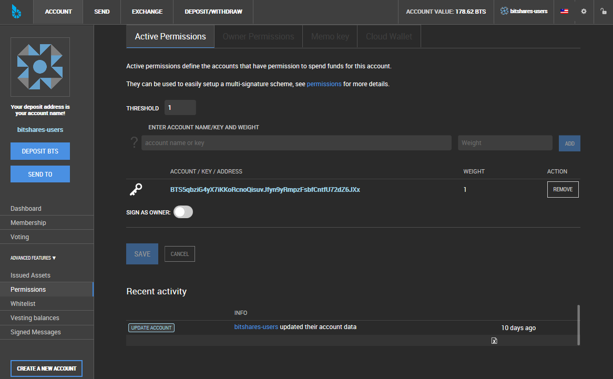
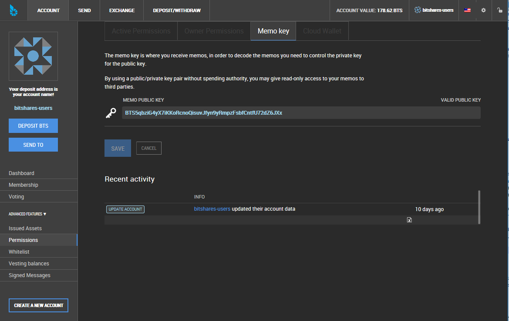

.. _account-permissions2:

Permissions 
====================

.. _security-permissions2: 
 
Permission Model-
-----------------------

We distinguish between two kinds of permissions:

* **Owner Permission**: This permission has administrative powers over the whole account and should be considered for 'backup' strategies.
* **Active Permission**: Allows to access funds and some account settings, but cannot change the owner permission and is thus considered the "online" permissions.

Both are implemented using `Elliptic Curve Cryptography`_ (ECC) with *public*
and *private* keys. 

.. _Elliptic Curve Cryptography: https://en.wikipedia.org/wiki/Elliptic_curve_cryptography

You can find the keys for your permissions in the ``Permissions`` tab:

*Pld image was here*

		
Both can be defined in the `Permissions` tab of your account using so called
*authorities* (see below) together with a so called *threshold* that has to be
exceeded in order for a transaction to be valid.

----------

Active Permissions
^^^^^^^^^^^^^^^^^^

|

Owner Permissions
^^^^^^^^^^^^^^^^^^

.. image:: account-permissions-owner.png
        :alt: Owner Permissions
        :width: 750px
        :align: center

|

Memo Key 
^^^^^^^^^^^^^^^^

|

Cloud wallet 
^^^^^^^^^^^^^^^^^^

.. image:: account-permissions-could-wallet.png
        :alt: Cloud Wallet Permissions
        :width: 750px
        :align: center

|

Authorities-
-----------------

In BitShares an *authority* consists of one or many entities that authorize an
action, such as transfers or trades.

An authority consists of one or several pairs of an account name with a
*weight*.

In order to obtain a valid transaction, the sum of the weights from signing
the parties has to exceed the threshold as defined in the permissions.

Examples
^^^^^^^^^^^^^

Let's discuss some examples to shed some light on the used terminology and the
use-cases. We assume that a new account is created with it's active permissions
set as described below. Note that the same scheme also works for the owner
permissions!

(Flat) Multi-Signature
^^^^^^^^^^^^^^^^^^^^^^^

A flat multi-signature scheme is composed of ``M`` entities of which ``N``
entities must sign in order for the transaction to be valid. Now, in BitShares,
we have *weights* and a *threshold* instead of ``M`` and ``N``. Still we can
achieve the very same thing with even more flexibility as we will see now.

Let's assume, Alice, Bob, Charlie and Dennis have common funds. We want to be
able to construct a valid transaction if only two of those agree. Hence a
**2-of-4** (N-of-M) scheme can look as follows:

+----------------+--------+ 
| Account        | Weight | 
+================+========+ 
| Alice          | 1      | 
+----------------+--------+ 
| Bob            | 1      | 
+----------------+--------+ 
| Charlie        | 1      | 
+----------------+--------+ 
| Dennis         | 1      | 
+----------------+--------+ 
| **Threshold:** | 3      | 
+----------------+--------+ 

This means that each party has the same weight of 1 while 3 parties need
to sign the transaction/proposal.

In other words: Alice, Bobe, Charlie and Dennis, each have 33% weight
while 100% must be reached.

.. image:: Multi-Signature.png
        :alt: Multi Signature
        :width: 400px
        :align: center

		
		
.. graphviz::

   digraph G {
    ranksep=0.5;
    nodesep=0.1;
    overlap=false;

    node [fontname=Verdana,fontsize=12]
    node [style=filled]
    node [fillcolor="#EEEEEE"]
    node [color="#EEEEEE"]
    edge [color="#31CEF0", dir=back, fontsize=9, fontname=Verdana]
    
    proposal -> Alice [label="33%"];
    proposal -> Bob [label="33%"];
    proposal -> Charlie [label="33%"];
    proposal -> Dennis [label="33%"];
   }

All four participants have a weight of 33% but the threshold is set to 51%.
Hence only two out of the four need to agree to validate the transaction.

Alternatively, to construct a 3-of-4 scheme, we can either decrease the weights
to 17 or increase the threshold to 99%.

(Flat) Flexible Multi-Signature
^^^^^^^^^^^^^^^^^^^^^^^^^^^^^^^

With the threshold and weights, we now have more flexibility over our funds, or
more precisely, we have more *control*. For instance, we can have separate
weights for different people. Let's assume Alice wants to secure here funds
against theft by a multi-signature scheme but she does not want to hand over too
much control to her friends. Hence, we create an authority similar to:

+----------------+--------+ 
| Account        | Weight | 
+================+========+ 
| Alice          | 49%    |
+----------------+--------+ 
| Bob            | 25%    |
+----------------+--------+ 
| Charlie        | 25%    |
+----------------+--------+ 
| Dennis         | 10%    |
+----------------+--------+ 
| **Threshold:** | 51%    |
+----------------+--------+ 

.. image:: Flexible-Multi-Signature.png
        :alt: Flexible Multi-Signature
        :width: 400px
        :align: center
		
		
.. graphviz::

   digraph G {
    ranksep=0.5;
    nodesep=0.1;
    overlap=false;

    node [fontname=Verdana,fontsize=12]
    node [style=filled]
    node [fillcolor="#EEEEEE"]
    node [color="#EEEEEE"]
    edge [color="#31CEF0", dir=back, fontsize=9, fontname=Verdana]
    
    proposal -> Alice [label="49%"];
    proposal -> Bob [label="25%"];
    proposal -> Charlie [label="25%"];
    proposal -> Dennis [label="10%"];
   }

Now the funds can either be accessed by Alice and a single friend or by all
three friends together.

Multi-Hierarchical Flexible Multi-Signature
^^^^^^^^^^^^^^^^^^^^^^^^^^^^^^^^^^^^^^^^^^^^^^

Let's take a look at a simple multi-hierarchical corporate account setup.  We
are looking at a company that has a Chief of Financial Officer (CFO) and a some
departments working for him, such as the Treasurer, Controller, Tax Manager,
Accounting, etc. The company also has a CEO that wants to have spending
privileges. Hence we construct an authority for the funds according to:

+------------------+--------+ 
| Account          | Weight | 
+==================+========+ 
| CEO.COMPANY      | 51%    |
+------------------+--------+ 
| CFO.COMPANY      | 51%    |
+------------------+--------+ 
| **Threshold:**   | 51%    |
+------------------+--------+ 

.. image:: Multi-Hierarchical_Flexible-Multi-Signature.png
        :alt: FMulti-Hierarchical Flexible-Multi-Signature
        :width: 400px
        :align: center
		
		
.. graphviz::

   digraph G {
    ranksep=0.5;
    nodesep=0.1;
    overlap=false;

    node [fontname=Verdana,fontsize=12]
    node [style=filled]
    node [fillcolor="#EEEEEE"]
    node [color="#EEEEEE"]
    edge [color="#31CEF0", dir=back, fontsize=9, fontname=Verdana]
    
    proposal -> "CEO.COMPANY" [label="51%"];
    proposal -> "CFO.COMPANY" [label="51%"];
   }

whereas CEO.COMPANY and CFO.COMPANY have their own authorities. For instance,
the CFO.COMPANY account could look like:

+-------------------------+--------+ 
| CFO.COMPANY             | Weight |
+=========================+========+ 
| Chief.COMPANY           | 51%    |
+-------------------------+--------+ 
| Treasurer.COMPANY       | 33%    |
+-------------------------+--------+ 
| Controller.COMPANY      | 33%    |
+-------------------------+--------+ 
| Tax Manager.COMPANY     | 10%    |
+-------------------------+--------+ 
| Accounting.COMPANY      | 10%    |
+-------------------------+--------+ 
| **Threshold:**          | 51%    |
+-------------------------+--------+ 

.. image:: cfo-Multi-Hierarchical_Flexible-Multi-Signature.png
        :alt: CFO Multi-Hierarchical Flexible-Multi-Signature
        :width: 870px
        :align: center
		
		
.. graphviz::

   digraph G {
    ranksep=0.5;
    nodesep=0.1;
    overlap=false;

    node [fontname=Verdana,fontsize=12]
    node [style=filled]
    node [fillcolor="#EEEEEE"]
    node [color="#EEEEEE"]
    edge [color="#31CEF0", dir=back, fontsize=9, fontname=Verdana]
    
    proposal -> "Chief.COMPANY" [label="51%"];
    proposal -> "Treasurer.COMPANY" [label="33%"]
    proposal -> "Controller.COMPANY" [label="33%"];
    proposal -> "Tax.COMPANY" [label="10%"]
    proposal -> "Accounting.COMPANY" [label="10%"];

    "Treasurer.COMPANY" -> {T1,T2,T3};
    "Controller.COMPANY" -> {C1,C2};
    "Tax.COMPANY" -> {X1,X2};
    "Accounting.COMPANY" -> {A1,A2,A3,A4,A5};

   }

This scheme allows:

* the CEO to spend funds
* the Chief of Finance Officer to spend funds
* Treasurer together with Controller to spend funds
* Controller or Treasurer together with wither the Tax Manager or Accounting to
  spend funds.

Hence, a try of arbitrary depth can be spanned in order to construct a flexible
authority to reflect mostly any business use-case.

|
