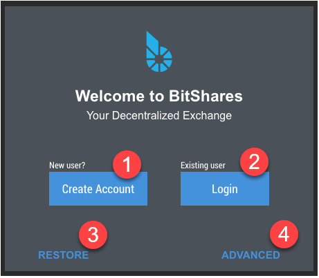
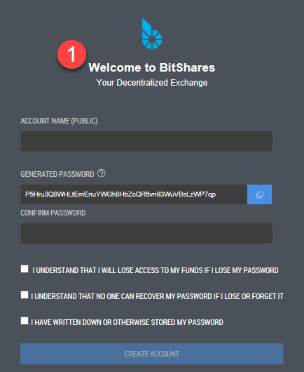
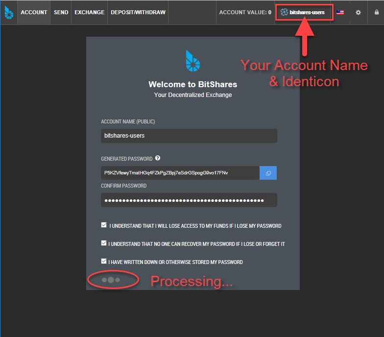
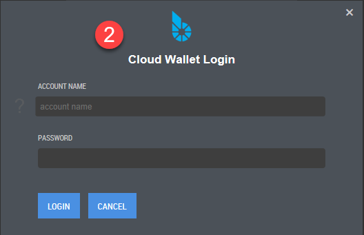
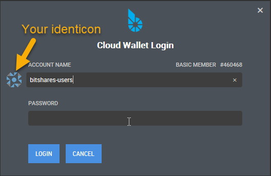
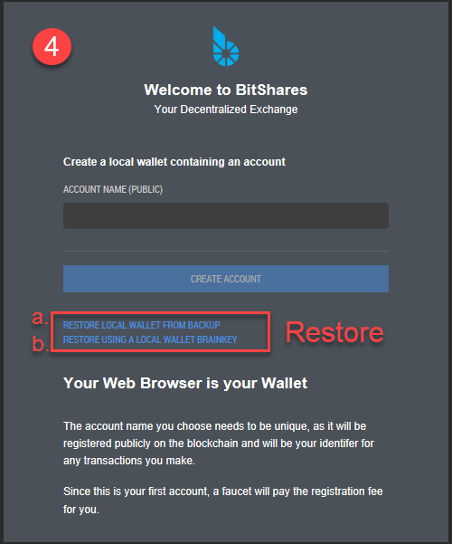
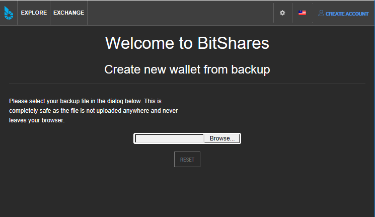
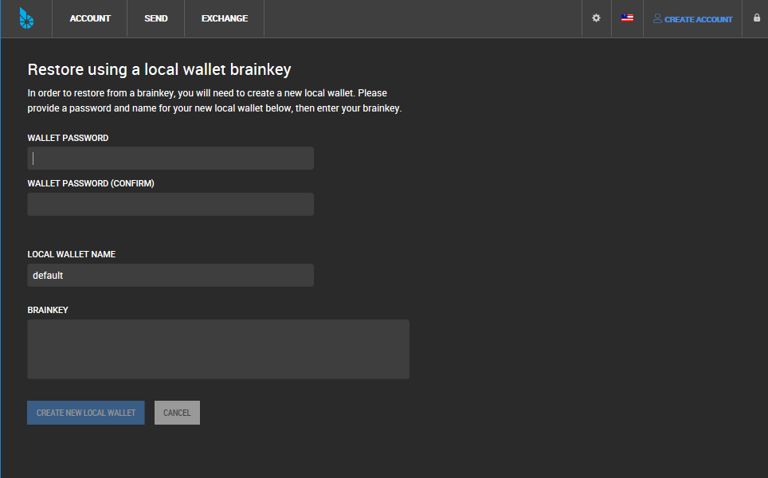

   
.. _user-registration3:
   
Create Your Wallet & Login
============================

   
.. _wallet-welcome:   
   
Welcome to BitShares
---------------------

**Your Web Browser is your Wallet.**  When you create your first BitShares account, your BitShares **Cloud Wallet** will be automatically created in your browser.

**If this is your first account, a faucet will pay the registration fee for you.**

|

web wallet: https://wallet.bitshares.org

:ref:`See more BitShares Partners <bitshares-web-client-partners>`
 

|

1. Create Account - New User (Recommended)
2. Login - Existing User
3. Restore from a backup
4. Advanced - Create a local wallet containing an account

.. _create-account3:
   
Create Account - New user
----------------------------

You create a **Cloud wallet**. And *Cloud Wallet Login* will be your default Login Mode.

In order to use BitShares, you will need to register an account. Your *account name* needs to be **unique**, as it will be registered publicly on the blockchain and will be **your identifer** for any transactions you make. 

This comes with many advantages: Besides improved scalability, we have separated the identity from the transaction authorizing signature. In practice, owning an account name is independent from being able to spend its funds. Furthermore, both rights (we call them *permissions*) can split among an arbitrary complex relation of people (we call them *authorities*) using weights and a required thresholds.

|

		
**STORE or WRITE DOWN YOUR PASSWORD!!! Keep it in a safe place.**

|		

1. Account Name (PUBLIC)
2. Generated Password - The generated password was created by your browser, locally. No one but you has access to it. Paste it the value and save a copy in a safe place.
3. (Blue squire - Click to copy the password to your clipboard) 
4. Confirm Password
5. After you read each statement, check the **Three check boxes**. - Save your password!! 
6. Click **Create Account**

|

During the process, you will find your account name and identicon.	

|	

In contrast to any other platform you have ever used: **Creating an
account at one of our partners will make your account available at ALL
the other partners as well.** Hence, your account name can be seen
similar to a mail address in such that it is **unique** and every
participant in the BitShares network can interact with you independent
of the actual partner providing the wallet.

|

We also provide a guide on how to **manually** register an account using the :ref:`CLI wallet <cli-wallet>`.
   
|

Cloud Wallet Login
------------------------

For existing users login:

1. Type your account name -- You will see your identicon!
2. Type your password

|	

|

Restore Backup
----------------

Restore from a **.bin** file. This is completely safe as the file is not uploaded anywhere and never leaves your browser.

Your backup file name would be a similar format like this "bts_default_20171121.bin" (bts_fedault_YearMonthDate.bin ).

1. Click **Browse...** to select your backup file
2. Type your password
3. Click **SUBMIT**

.. image:: account-w4-restorebackup.png
		:alt: Create new account
		:width: 550px
		:align: center

|

.. image:: account-w4-restorebackup2.png
		:alt: Create new account
		:width: 550px
		:align: center

|		

.. _fund-account2:

Fund your Account
--------------------

In order to fund your account you have options:

* **Transfers**: Ask a partner or exchange to send funds to you.
  To do so, you will only need to **provide them with your account name**.
 
* **Transfers**: Use BlockTrades direct exchange service. :ref:`Learn more information... <exchange-buy-bts>`  

| 

* **Deposits**: By visiting your **deposit/withdraw** page in your
  account's navigation, you can use one of our partners to move over
  existing funds into your BitShares account. :ref:`Learn more information... <deposit-withdraw-trans>`  

  .. image:: account-deposit1.png
		:alt: Create new account
		:width: 550px
		:align: center

|
 
In order to understand the meanings of different assets, we recommend you to
read through our :ref:`assets page <assets-tokens>`.

|
	

----------

----------
		
.. _create-account-advanced:
   
Create a Local Wallet Account (ADVANCED)
-------------------------------------------

|

.. _restore-import-adv:

Restore/Import (Advanced)
-------------------------

a. Restore Local Wallet From Backup
^^^^^^^^^^^^^^^^^^^^^^^^^^^^^^^^^^^^

Restore from a **.bin** file. This is completely safe as the file is not uploaded anywhere and never leaves your browser.

	
|
		

b. Restore Using a Local Wallet Brainkey
^^^^^^^^^^^^^^^^^^^^^^^^^^^^^^^^^^^^^^^^

In order to restore from a brainkey, you will need to create a new local wallet. Please provide a 
password and name for your new local wallet below, then enter your brainkey.  :ref:`Learn more information... <security-brainkey>`

|

----------

READ More **Technical Information**: :ref:`Account Registration for Developer <create-account-dev>`

|
