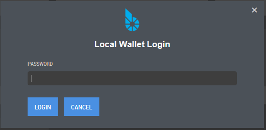

.. _bitshares-client:

BitShares Client
==================

BitShares is different from anything you have experienced yet and as
such, a user should know about advantages, risks, and opportunities. As
a starter, we highly recommend to read through the
**Introduction** to get a first impression of what BitShares is
and how it is different to existing systems.

Choose Your Client
-----------------

**You have sole control of your accounts and funds** and they are created on your computer
(within the **light-client** or the browser **web-client**). Hence, you will only be able
to access your account on the computer that you have used to register
and create your account, unless you create a backup your wallet and import it
somewhere else.

Light Client 
^^^^^^^^^^^^^^^^^^

Download client files and **install BitShares Wallet to your computer**.

* `Download the Official Light Client <http://bitshares.org/download/>`_
* `BitShares-UI -- Latest Release <https://github.com/bitshares/bitshares-ui/releases>`_

**BitShares-UI:** This is a light wallet that connects to a BitShares API provided by the witness_node executable.
It stores all keys locally in the browser, never exposing your keys to anyone as it signs transactions locally before transmitting them to the API server which then broadcasts them to the blockchain network. The wallet is encrypted with a password of your choosing and encrypted in a browser database.

.. _bitshares-web-client-partners:

Web Client
^^^^^^^^^^^^^^^^^

Access the network in the browsers via one of our partners:

* wallet.bitshares.org https://wallet.bitshares.org
* OpenLedger: https://openledger.info
* `RuDEX <https://rudex.org/index_eng.html>`_
* `CryptoBridge <https://crypto-bridge.org/>`_ 
* https://openledger.io/
* `BINANCE <https://www.binance.com>`_
* https://market.rudex.org/ 
* https://bit.btsabc.org 
* https://www.hellobts.com/ 
* https://www.freedomledger.com/ 
* https://btsgo.net
* https://trade.1001ico.com 

|

Wallet & Login Mode
--------------------

Wallet 
^^^^^^^^^^^^

As you may have noticed already, this application is a web application and runs in a browser. A connection is established to a trusted node in the network that serves as a gateway to the rest of the ecosystem.

Cloud Wallet Login
^^^^^^^^^^^^^^^^^^

If you registered with a *username* and *password*, you have a cloud wallet. Although nothing is technically stored in the cloud, we use the term Cloud Wallet because **you can use these credentials (username and password) from any web browser at any time to gain access to your account**. 

The cloud wallet only allows for a single account to be accessed at a time. This is generally the **correct choice for a new user**. While is possible to change the auto-generated password, we do not recommend doing so at this time. The team is working on a responsible way to manage the password change that requires no technical knowledge. We will make an announcement once it's released.

**Login Form**

.. image:: login-cloud.png
        :alt: Login Cloud Wallet
        :width: 450px
        :align: center	

|

Local Wallet Login
^^^^^^^^^^^^^^^^^^^^^

The local wallet creates a **database within your browser**. This means that **access to your funds it tied to that browser only**. If you attempt to access your local wallet from any other computer, or any other browser, it will fail unless you actively import your backup file from the original browser backup file. The process actually easy. 

**Login Form**

		
|

Terminology
------------------

Most clients distinguish between accounts from wallets and all of they
use keys to access funds.

* **Accounts**: Each user has at least one account that can be used to
  interact with the blockchain. In the end, this can be seen as a single
  banking account with an individual balance, transaction history, etc.
  Since these accounts are registered on the blockchain and are open to
  the public, we recommend to pick a pseudonym to achieve some privacy.
  The advantage of using account names is that people can identify you
  by using a readable and memorable word instead of cryptographic
  addresses.
  As you may have already noticed by now, this blockchain technology requires you to register an account name. This comes with many advantages: Besides improved scalability, we have separated the identity from the transaction authorizing signature. In practice, owning an account name is independent from being able to spend its funds. Furthermore, both rights (we call them permissions) can split among an arbitrary complex relation of people (we call them authorities) using weights and a required thresholds.
 
|
 
* **Wallet**: Since users can (if they have a lifetime membership)
  register multiple accounts in parallel, all of them are stored in a
  single wallet. Hence, a wallet can carry many accounts. Furthermore,
  users can create multiple wallets to organize their accounts properly.

|

* **Keys**: Keys refer to the cryptography used to secure access to your
  account and funds. It is of importance to prevent others from gaining
  access to these. This is why you have to provide a passphrase that is
  used to store the keys in an encrypted way.

|	