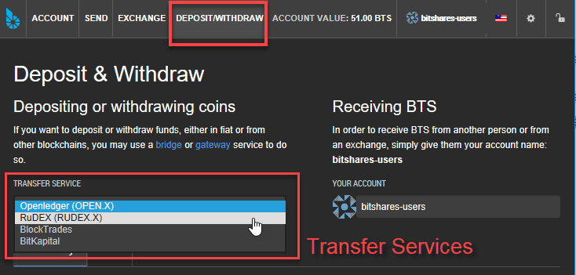
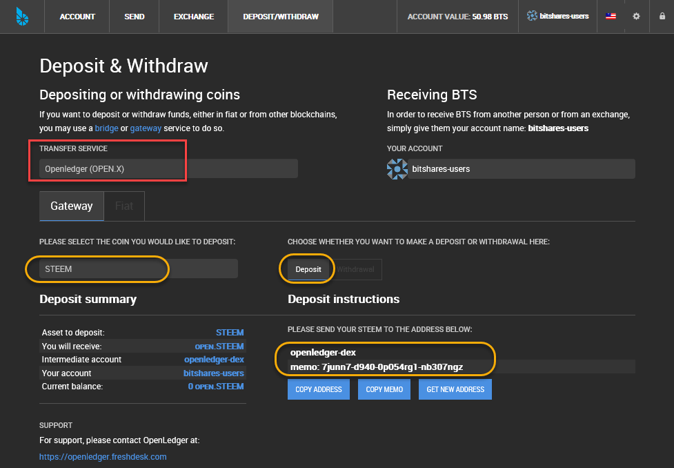
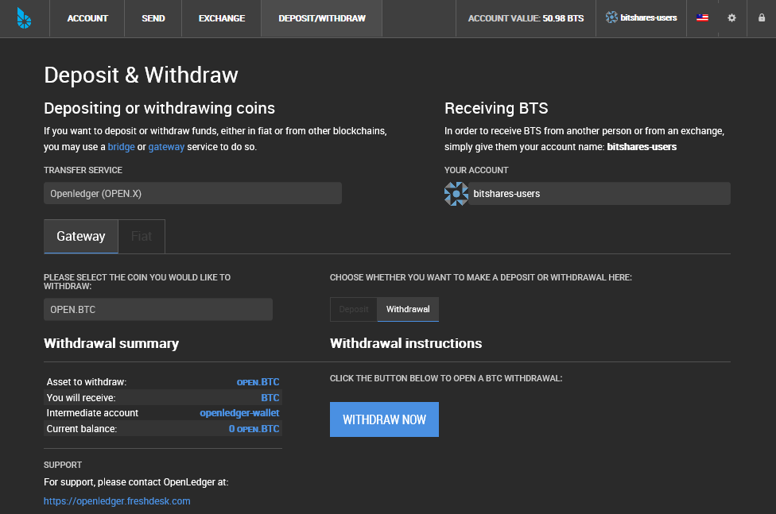
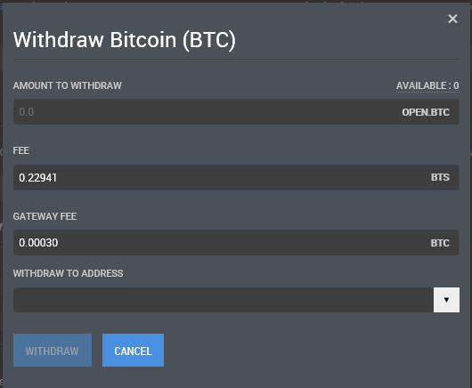
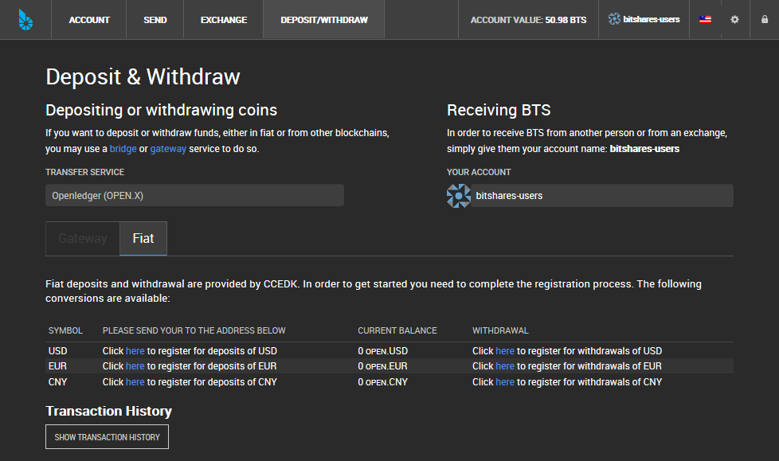
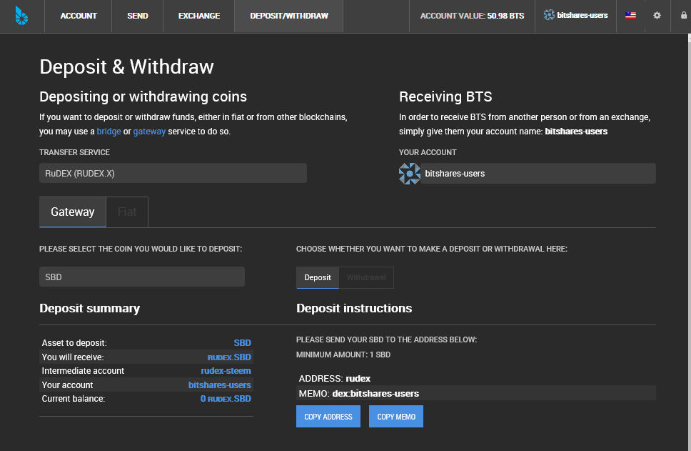
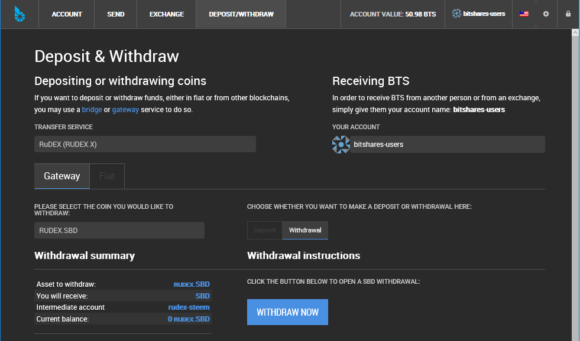
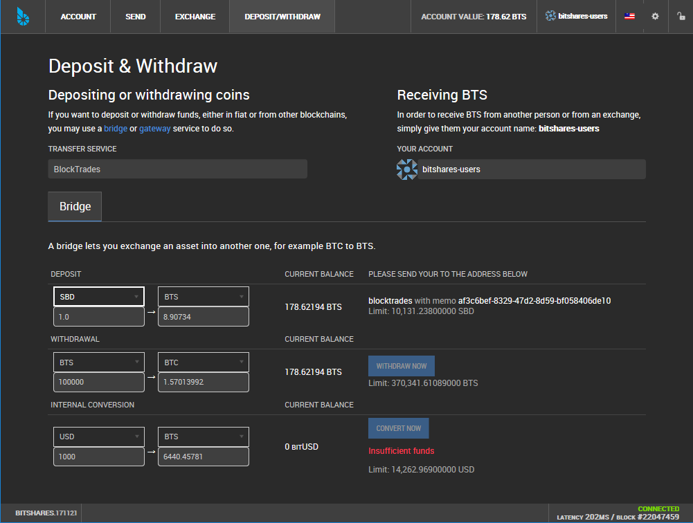
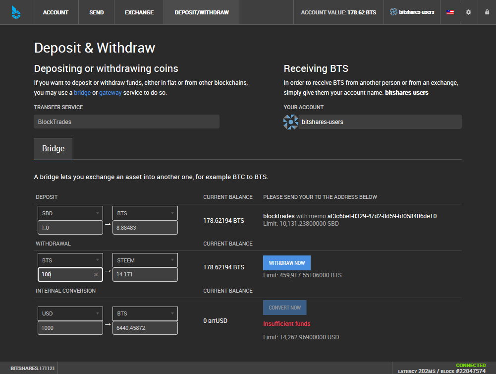
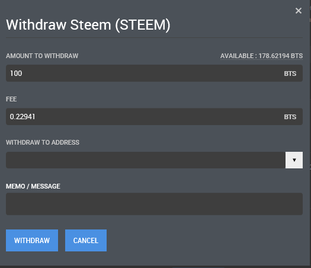

.. _daposit-withdraw:

Deposit & Withdraw
=========================

Transfer Services
----------------------------

BitShare has Transfer Services' partners. You can select to transfer your funds.

* Openledger (OPEN.X)
* RuDEX (RUDEX.X): https://rudex.org/index_eng.html
* BlockTrades: https://blocktrades.us/

		
|		

Openledger (OPEN.X)
^^^^^^^^^^^^^^^^^

Deposit
~~~~~~~~~~~~~

(e.g.) Deposit STEEM

1. Click Deposit
2. Click gray area to open a dropdown list and select STEEM
3. Copy the address and/or Memo to transfer

|

Withdraw
~~~~~~~~~~~~~~~
1. Click Withdraw
2. Click gray area to open a dropdown list and select the Coin you would like to withdraw
3. Click **WITHDRAW NOW** to open a withdraw form
4. Fill **Amount to Withdraw**
5. Fill **Withdraw to Address**
6. Click **WITHDRAW**

|

|

Fiat
~~~~~~~~~~

|
	

RuDEX (RUDEX.X)
^^^^^^^^^^^^^^^^^^^^

Deposit
~~~~~~~~~~~~

(e.g.) Deposit SBD

1. Click Deposit
2. Click gray area to open a dropdown list and select SBD
3. Copy the address and/or Memo to transfer

|

Withdraw
~~~~~~~~~~~~~
1. Click Withdraw
2. Click gray area to open a dropdown list and select thr Coin you would like to withdraw
3. Click **WITHDRAW NOW** to open a withdraw form
4. Fill **Amount to Withdraw**
5. Fill **Withdraw to Address**
6. Click **WITHDRAW**

|

BlockTrades
^^^^^^^^^^^^^^^^^^^^

BlockTrades provides **Direct Exchange Service** that's easy way to purchase BTS. Learn more about :ref:`Direct Exchange Service <exchange-buy-bts>`

Deposit
~~~~~~~~~~~~

1. Select a currency you would like to deposit to buy BTS
2. Copy the address and/or Memo to transfer 

|

Withdraw
~~~~~~~~~~~

1. Select a currency you would like to withdraw
2. Type in an amount
3. Click **WITHDRAW NOW** to open a form
4. Fill WITHDRAW TO ADDRESS
5. Fill MEMO / MESSAGE
6. Click **WITHDRAW**

 

|

|

Bridge and gateway services
-------------------------------

Both bridges and gateways allow you to deposit and withdraw coins, but there is a difference in the amount of trust you need to place in the service providers.

Bridges: trust-free model
^^^^^^^^^^^^^^^^^^^^^^^^^^^^^
A bridge service provides a way to deposit an amount of a crypto-currency other than BitShares, and in turn receive a SmartCoin equivalent. SmartCoins have no counterparty risk, so the only risk you experience when using a bridge is during the short time it takes to complete the transfer. This is better than a centralized exchange such as Poloniex, where you are always at risk of the exchange being hacked, going bankrupt, or experiencing any number of other issues.

Gateways: trust-based model
^^^^^^^^^^^^^^^^^^^^^^^^^^^^^^^
Gateways are basically equivalent to the standard exchange model where you depend on the solvency of the exchange to be able to redeem your coins. Generally gateways issue assets prefixed with their symbol, like OPEN, TRADE, or META. These assets are backed 100% by the real BTC or ETH or any other coin that people deposit with the gateways.

An OPEN.BTC is thus in theory equivalent to the BTC you get on Poloniex, which could be prefixed POLO.BTC. In both cases you rely on the service provider, CCEDK for OPEN. assets and Poloniex for POLO. assets, to remain solvent in order to back the value of the assets they've issued. Because gateways only provide this one service which is normally only one part of running an exchange, one might even argue that they have an easier job of securing their holdings.

|