.. _exchange-wallet:

Exchange / Explore
=======================

Exchange
----------------------

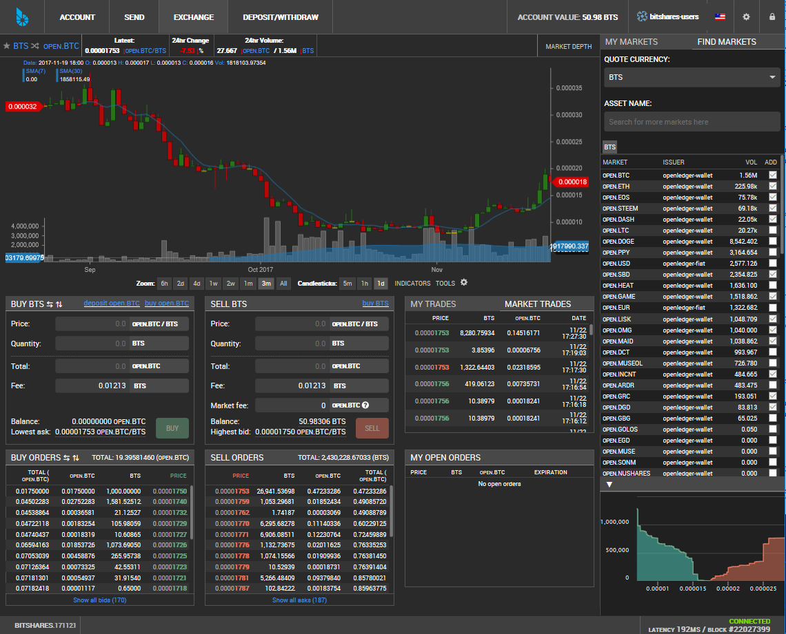

|

.. _exchange-buy-bts:

Direct Exchange Service
--------------------------

Buy BTS with BlockTrades
^^^^^^^^^^^^^^^^^^^^^^^^^

This functionality makes us easy way to purchase BTS. When you are in BitShares Wallet Exchange, click **buy BTS**. It will open a form to simulate *SEND* and *RECEIVE* prices. And also it will give you address and/or Memo information.  

|

If you could not find a correct pair...

e.g. How to find a pair: open.STEEM x BTS

1. Click FIND MARKET
2. Select **BTS** from QUOTE CURRENCY list
3. Click **open.STEEM**

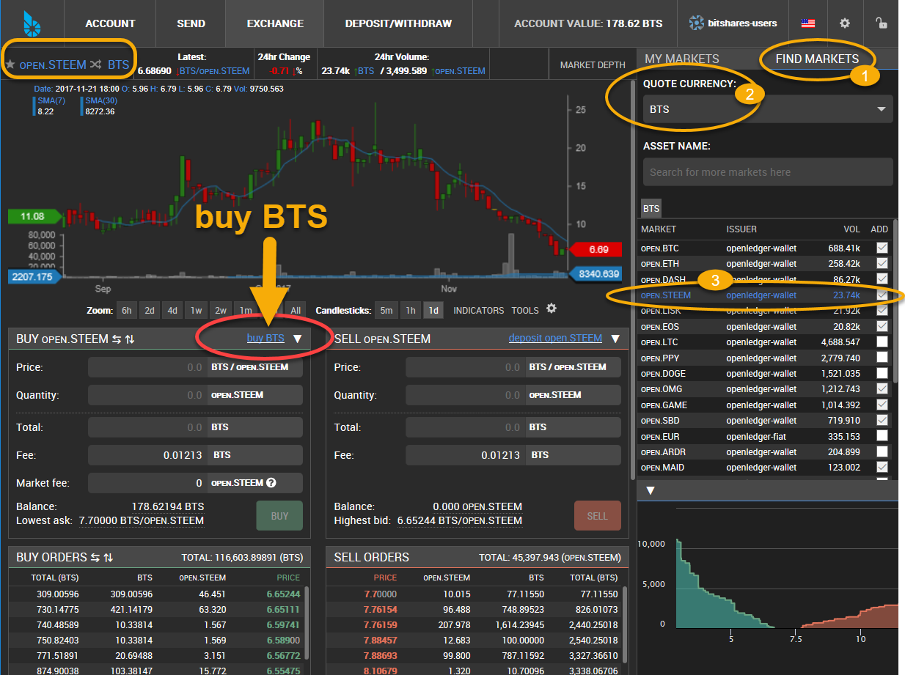

|

Step by step
~~~~~~~~~~~~~~

You will learn how easy way to purchase BTS by using BlockTrades Direct Exchange Service. No additional balance sheet. You have less steps to purchase BTS. 

*-Scenario-*

"I created BitShares wallet. I want to buy some BTS. I have STEEM in my steemit wallet. Can I use the STEEM to buy BTS and send it to my BitShares wallet directly? "

"Yes, you can do!" 

1. Go to your BitShares wallet and open Exchange page
2. Click "buy BTS" to Open the Buy form
3. Select your SEND currency
4. Type an amount you want to spend and check how much you would receive BTS
5. Copy the **address** (e.g. blocktrades) and save it  (text, email etc) for later to use
6. Copy **Memo** (e.g. 8b5286a3-301f-40f7-b3e7-e4a1d60d9f7b) and save it (text, email etc) for later to use 
7. Click **CLOSE**
8. Go to your steemit Wallet

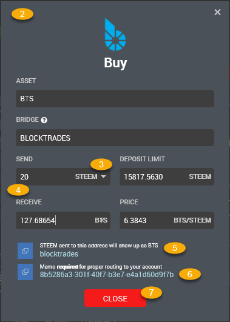
		
|

9. Select **Transfer** from STEEM dropdown

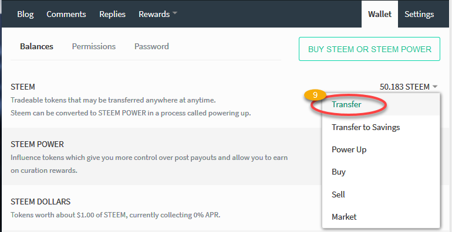
		
|

10. Paste the **address** into **To** textbox
11. Type in **Amount** you want to spend
12. Paste **Memo** into **Memo** textbox
13. Click **Submit**

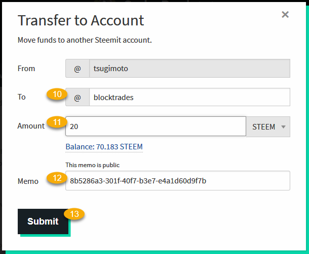
		
|

14. Login to Comment - **Sign In** (You might be asked to login.)

**That's it! Done!!**

|

15. Let's check BitShares wallet Activity tab

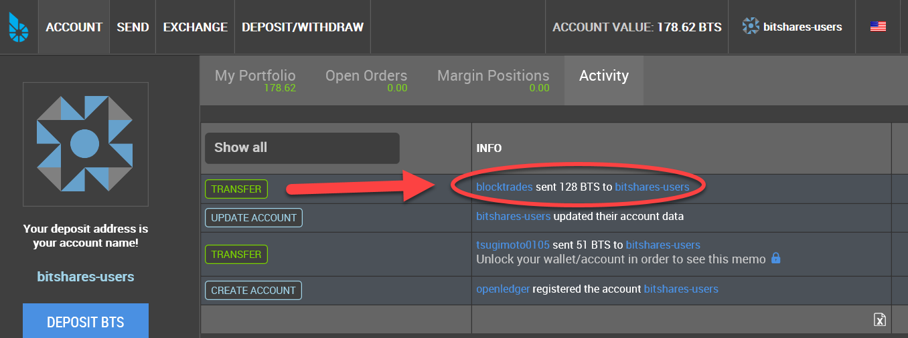
		
|

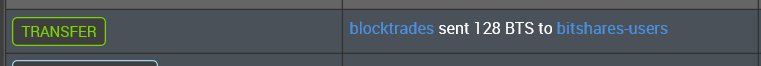
		
|

16. Let's check My Portfolio

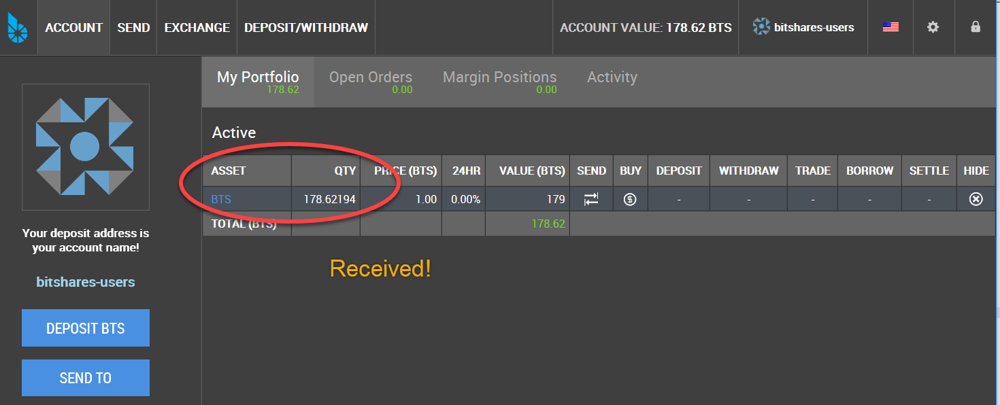
		
|

17. Let's check steemit Wallet History

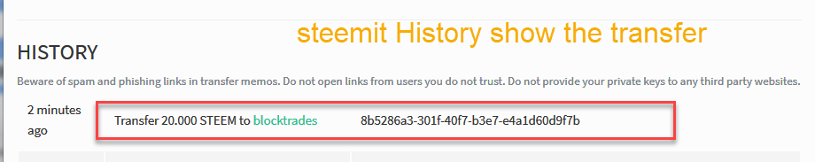
		
|

|

Explore
------------

.. image:: wallet-explore.png
        :alt: Explore
        :width: 550px
        :align: center
|

**Blockchain**

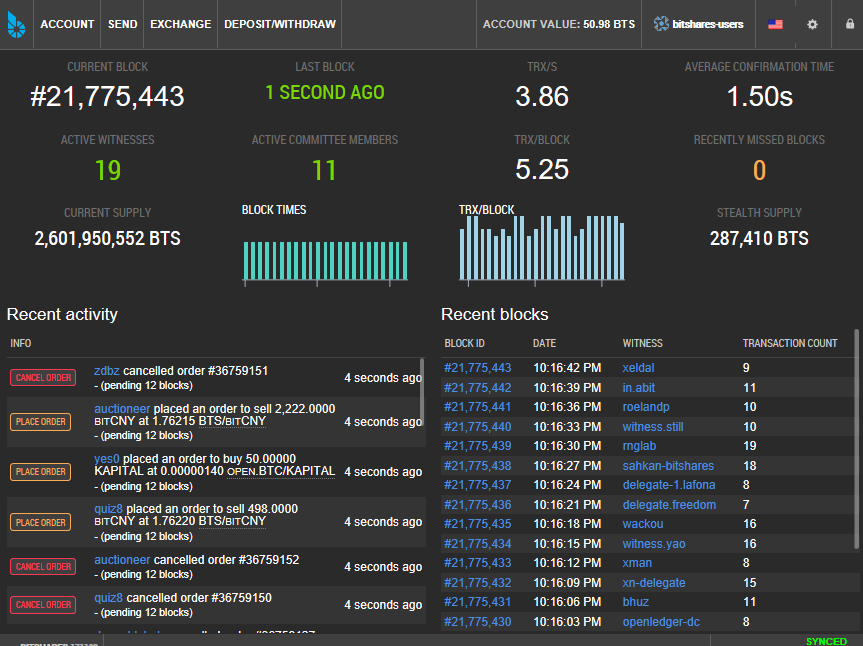
		
|

**Assets**

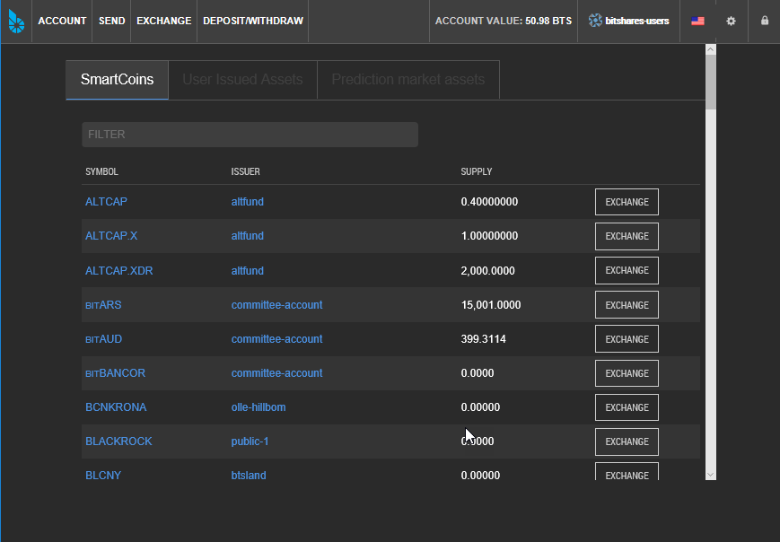
		
|

**Witness**

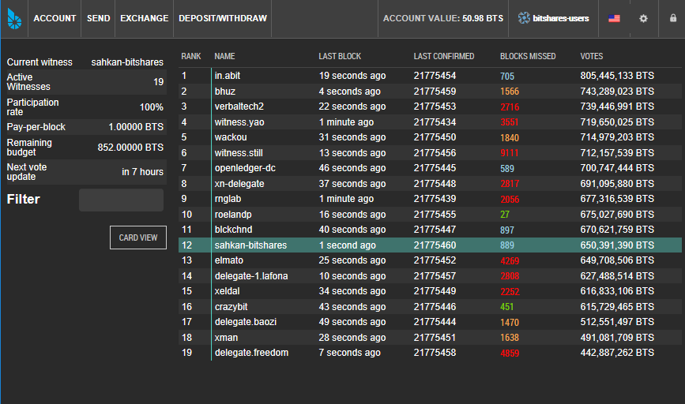
		
|

**Committee**

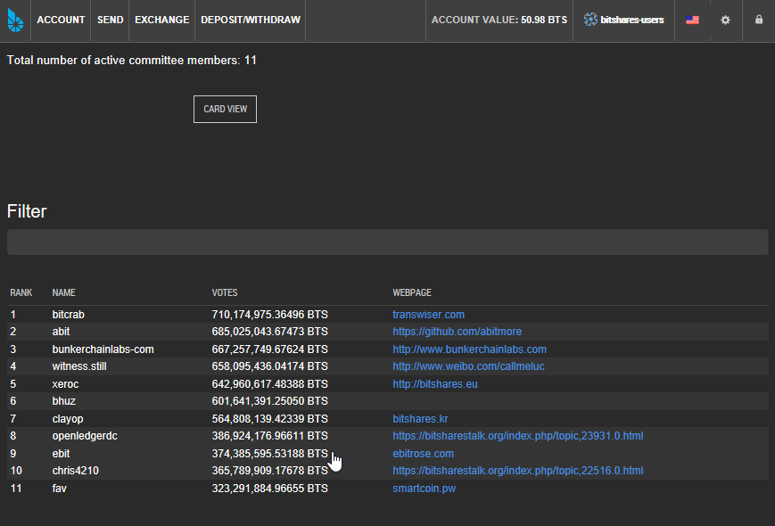
		
|

**Market** 

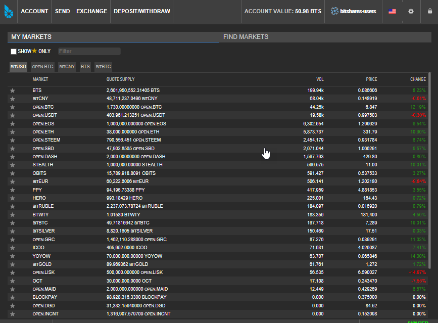
		
|

**Fees** 

.. image:: explore-Fee-schedules.png
        :alt: Explore Fees
        :width: 550px
        :align: center
		

   
|   