 
.. _security:
 
Backups (Security) & Restore
===============================

Rest assured that our servers do not have access to your funds because none of your private keys ever leave your browser. Instead, they are encrypted with your passphrase and are stored in your local browser's database. As such, you should make sure to have a proper Backup in the event something happens to your computer or browser

It is recommended to **make regular backups of your Local Wallet** even though in most cases a single backup may be sufficient. Please note that in order to recover from a backup you will also need to provide the passphrase (password) because **backups are encrypted**. Hence, if you either lose your wallet or your passphrase you will be unable to access any of your funds again!  

----------

**If you can not find "Backup"**

**Check...**

* Are you in :ref:`Local Wallet Mode <local-wallet-login-mode>`?
* Have you created "NEW LOCAL WALLET"?  (Settings - :ref:`Local Wallet <settings-new-local-wallet>` - Active Local Wallet:)

----------

Create Local Wallet Backup	
-----------------------------

Since you are the only individual that has access to your account and funds, it is your responsibility to make a secure backup of your registered account.

1. Backup locates **Settings** 
2. Click **Backup**
3. Click **CREATE BACKUP NOW**
4. Click **Download** 
5. Store the file **safely**.
   
|

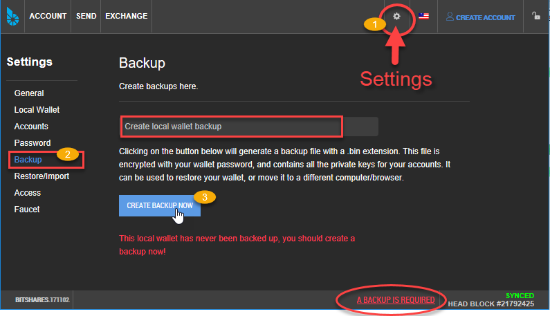
	
|

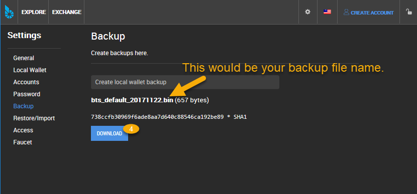
	
|

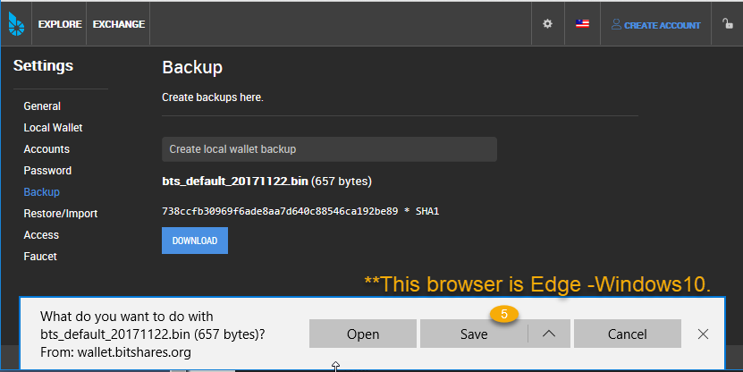
	
|

* Store this backup in at least two secure locations only accessible by you
* The backup is encrypted with your passphrase/password so do not store your passwrod in the same location

|

**If you have a latest backup...**

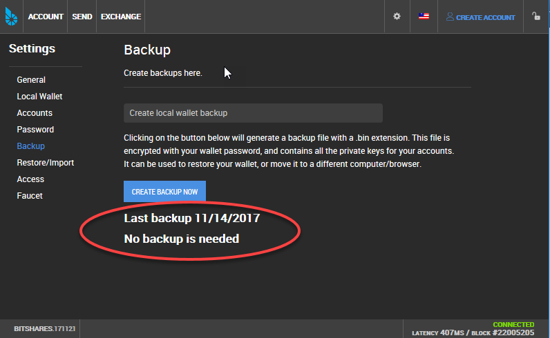
	
|

.. _restore-import-0:

Restore/Import
---------------------

.. _restore-backup-1:

a. Restore from Backup file (when Login)
^^^^^^^^^^^^^^^^^^^^^^^^^^^^^^^^^^^^^^^^^

You will find this form when you login and click RESTORE from a backup file. This is completely safe as the file is not uploaded anywhere and never leaves your browser.

Your backup file name would be a similer format like this "bts_default_20171121.bin" (bts_fedault_YearMonthDate.bin ).

1. Click **Browse...** to select your backup file
2. Type your password
3. Click **SUBMIT**

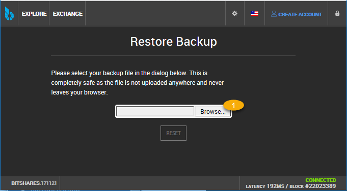

|

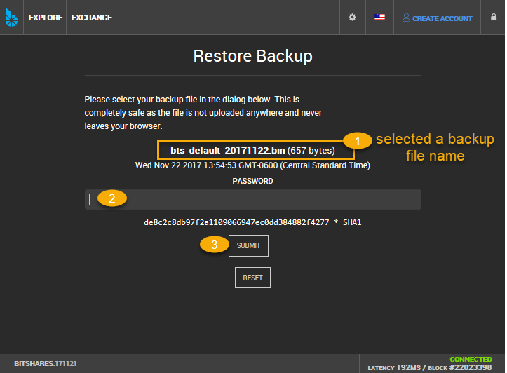
		
		
|	

.. _restore-import-2:

b. Restore/Import from a Backup file
^^^^^^^^^^^^^^^^^^^^^^^^^^^^^^^^^^^^^

If you are in Cloud wallet (check Settings - General - Login Mode), you will see **Local wallet required**. 
In order to restore a backup, you will need to switch to a local wallet first.

1. Click **ENABLE LOCAL WALLET** button
2. Click **Browse...** to select your backup file
3. Type your password
4. Click **SUBMIT**

.. image:: wallet-setting-restore-import.png
        :alt: Restore/Import from a backup file
        :width: 650px
        :align: center
	
		
|
After clicked **ENABLE LOCAL WALLET**, the page will switch to the below (Local Wallet Settings) page.

|	
.. _restore-import-3:

.. image:: wallet-setting-restore-import2.png
        :alt: Restore/Import from a backup file
        :width: 700px
        :align: center
	

|

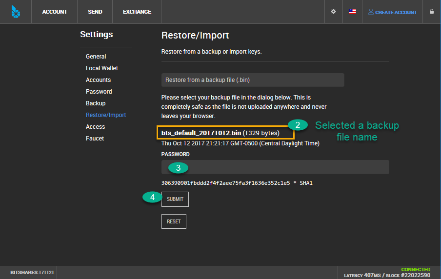
	

|

  
.. _security-brainkey:
  
Advanced Users Only
--------------------------
  
The Brain Key
^^^^^^^^^^^^^^^

If you never manually imported an account key into your wallet, you can alternatively backup your accounts and their funds by exporting the brainkey, a string of words from which your keys are derived deterministically.

**Remark: Hierarchical Authorities (advanced uses ONLY)**

If you are using hierarchical authorities (account and/or active permissions), backing up your keys alone may not be sufficient to regain access to your funds! Please revise the documentations about hierarchical authorities.

----------
  
The *brain key* is used as source for all cryptographic keys generated in the
wallet. If you have it secured, you will be able to regain access to your
accounts and funds (unless the access keys have been changed)

Backing Up the Brain Key
^^^^^^^^^^^^^^^^^^^^^^^^^^^

The brain key can be backed up as a string using the *Wallet Management
Console** in your settings.

.. image:: bk-brainkey-1.png
        :alt: backup brainkey
        :width: 650px
        :align: center
		
|		

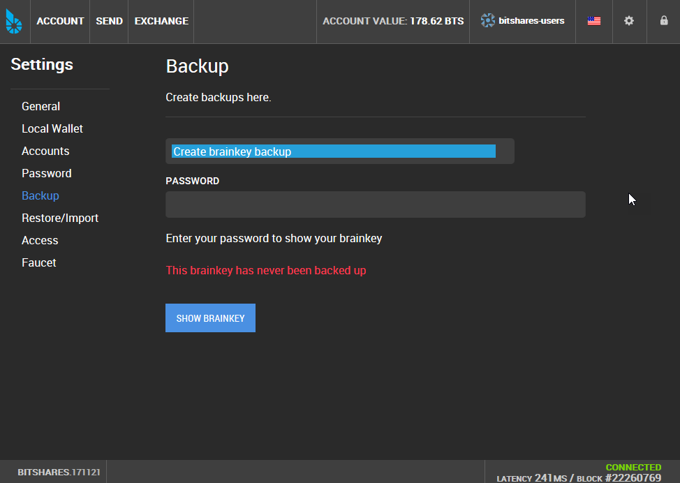
		
|

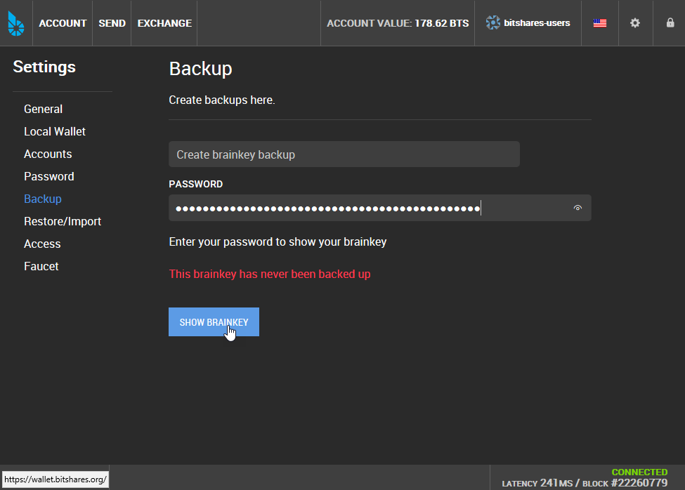
		
|

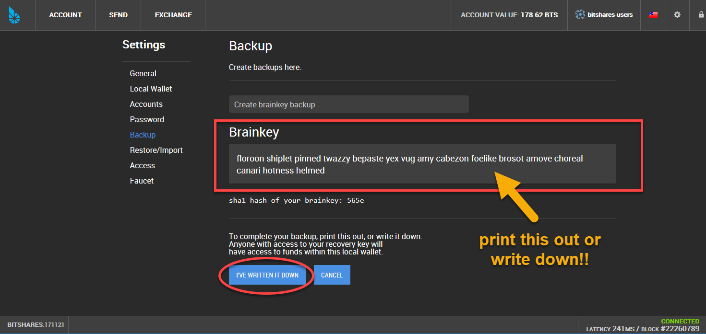
|

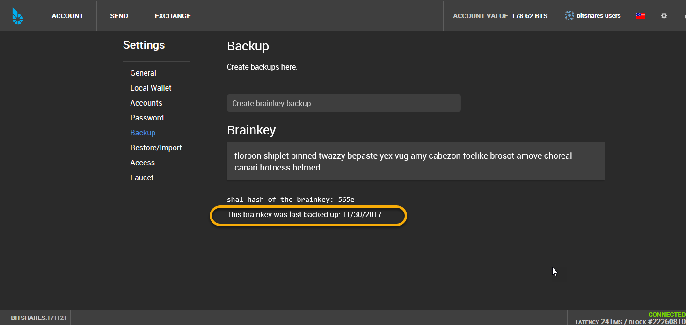
		
|

		
Restoring from Brain Key
^^^^^^^^^^^^^^^^^^^^^^^^^^^

Your wallet can be restored with the brain key from the GUI. When creating a new
wallet there is a link at the bottom, ``Existing Accounts``. From there select
``Create Wallet`` and then ``Custom Brain Key (Advanced)`` from the bottom.

.. _recover-from-brainkey:

Recover account with brain key
^^^^^^^^^^^^^^^^^^^^^^^^^^^^^^^

If you have the brain key, then you can reclaim access to your
account(s) and its funds by

1. Open the Settings
2. Click Restore/Import
3. Click a Gray box 
4. Click "Restore using a local wallet brainkey"
5. Provide WALLET PASSWORD
6. provide the BRAINKEY
7. Click "CREATE NEW LOCAL WALLET"

	

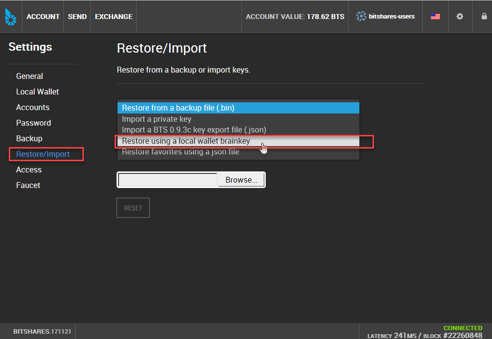
		
|

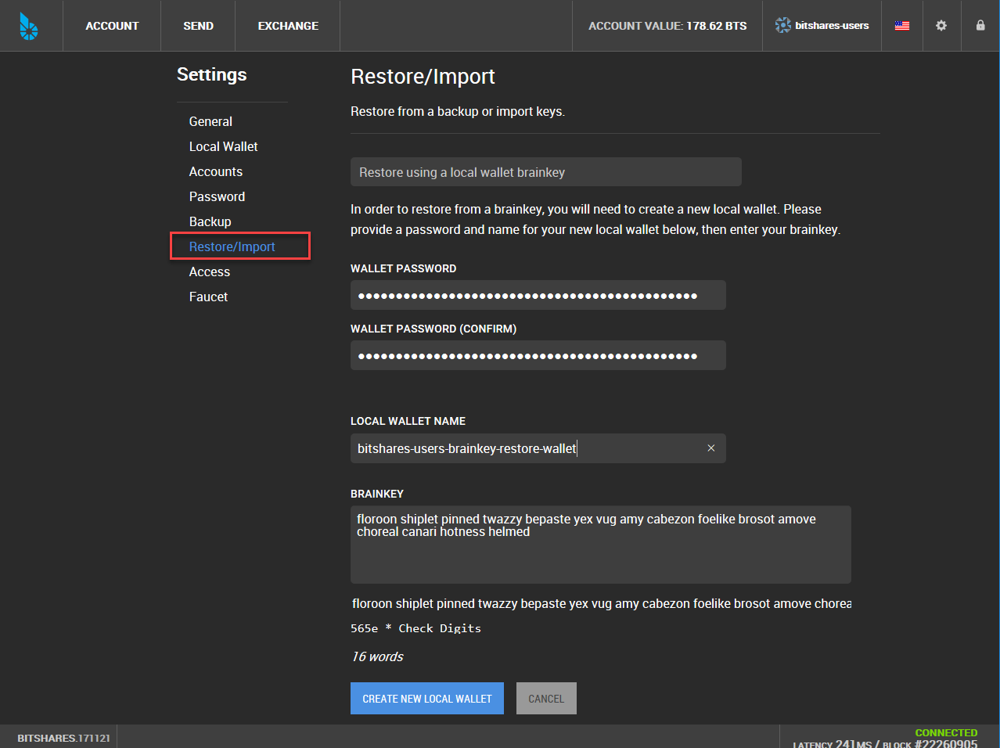
		
|

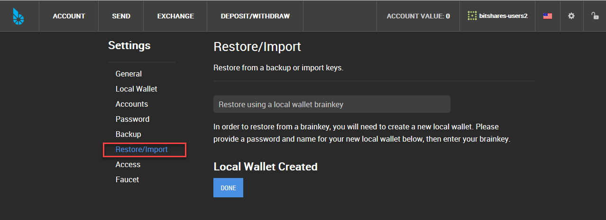
		

		

|