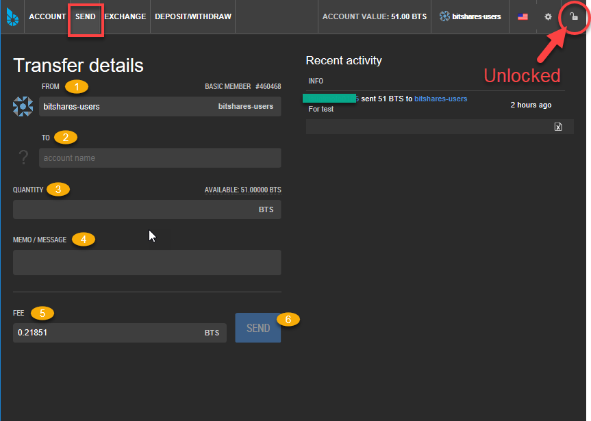
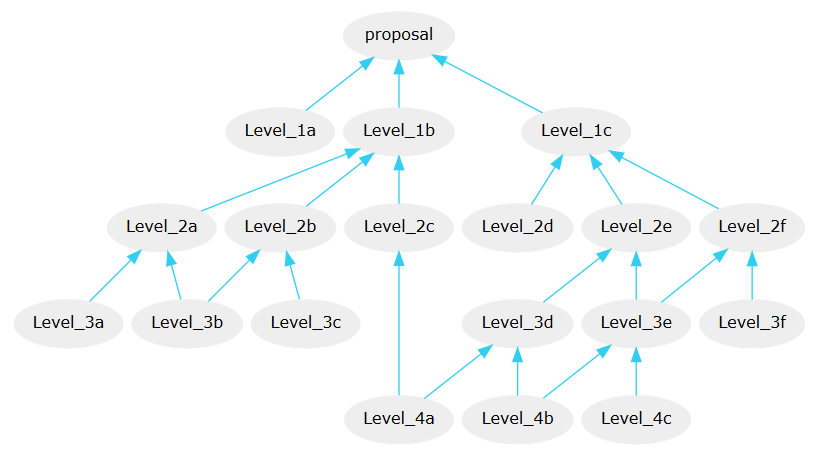

.. _transactions:

Send & Transactions
========================

BitShares 2.0 implements a variety of operations besides simple transfers of
funds. For instance in order to operate the :doc:`decentralized exchange
<dex>` we need support for buy, sell orders as well. The technical
documentation about all operation types can be found in our `doxygen docs`_.

.. _doxygen docs: https://bitshares.org/doxygen/group__operations.html

|

.. _moving-funds:
	  
.. _simple-transfers

Sending Funds (Simple Transfers)
---------------------------------

A simple transfer operation moves funds from user ``A`` to user ``B``.
In contrast to most other blockchain-based financial networks, we do **not** use
*addresses* or *public keys* for transfers.

|

Instead, all that is needed for transfers is:

1. From: Account Name
2. To: Destination Account Name
3. Quality: funds (amount and asset to send)
4. Memo/Message: (optional)
5. Fee
6. Click SEND

|

|

A transfer may contain a memo with arbitrary text.

.. note:: The ``memo`` is **encrypted** by default can only be decrypted by the
   participants of the transfer! The transfer fee depends on the length of the
   memo!

.. note:: On the BitShares blockchain, people never need to deal with
		  *addresses* or *public keys* but can instead use account
		  names. 

		   
   
.. _proposed-transactions:

Proposed Transactions
----------------------

The Graphene technology allows users to *propose* a transaction on the
blockchain which requires approval of multiple accounts in order to execute.

At any time, a proposal can be approved in a single transaction if sufficient
signatures are available (see ``proposal_update_operation`` as constructed by
the ``approve_proposal`` call), as long as the authority tree to approve the
proposal does not exceed the maximum recursion depth. In practice, however, it
is easier to use proposals to acquire all approvals, as this leverages on-chain
notification of all relevant parties that their approval is required. Off-chain
multi-signature approval requires some off-chain mechanism for acquiring several
signatures on a single transaction.  This off-chain synchronization can be
avoided using proposals.

The user proposes a transaction, then signatory accounts use add or remove their
approvals from this operation. When a sufficient number of approvals have been
granted, the operations in the proposal are evaluated. Even if the transaction
fails, the proposal will be kept until the expiration time, at which point, if
sufficient approval is granted, the transaction will be evaluated a final time.
This allows transactions which will not execute successfully until a given time
to still be executed through the proposal mechanism. The first time the proposed
transaction succeeds, the proposal will be regarded as resolved, and all future
updates will be invalid.

The proposal system allows for arbitrarily complex or recursively nested
authorities. If a recursive authority (i.e. an authority which requires approval
of 'nested' authorities on other accounts) is required for a proposal, then a
second proposal can be used to grant the nested authority's approval. That is, a
second proposal can be created which, when sufficiently approved, adds the
approval of a nested authority to the first proposal. This multiple-proposal
scheme can be used to acquire approval for an arbitrarily deep authority tree.

|

.. graphviz::

   digraph G {
     ranksep=0.5;
     nodesep=0.1;
     overlap=false;

     node [fontname=Verdana,fontsize=12]
     node [style=filled]
     node [fillcolor="#EEEEEE"]
     node [color="#EEEEEE"]
     edge [color="#31CEF0", dir=back, fontsize=9, fontname=Verdana]
     
     proposal -> { Level_1a, Level_1b, Level_1c };

     Level_1b -> { Level_2a, Level_2b, Level_2c }
     Level_1c -> { Level_2d, Level_2e, Level_2f };

     Level_2a -> { Level_3a, Level_3b };
     Level_2b -> { Level_3b, Level_3c };
     Level_2e -> { Level_3e, Level_3d };
     Level_2f -> { Level_3f, Level_3e };

     Level_3d -> { Level_4a, Level_4b };
     Level_3e -> { Level_4b, Level_4c };

     Level_2c -> Level_4a;

    }

Note that each account in the figure can carry a **different weight**. An example
of how to setup your permissions accordingly is given in
:ref:`account-permissions`.

Confidential Transactions
--------------------------

A confidential transfer is one that hides the amount being sent. Confidential
transfers are also referred to as blinded transfers. It makes use of Oleg
Andreev's `blind signatures`_.

When privacy is important no account is ever used twice and it is impossible for
any third party to identify how money is moving through blockchain analysis
alone.

.. note:: Confindential transactions are currently only available using the
   :ref:`cli-wallet`. A step-by-step guide
   can be found in the guide - :ref:`confidential-transactions-guide`

.. _blind signatures: http://blog.oleganza.com/post/77474860538/blind-signatures

|