   
.. _wallet-settings:
   
Wallet Settings
================

  
Wallet Icons
----------------

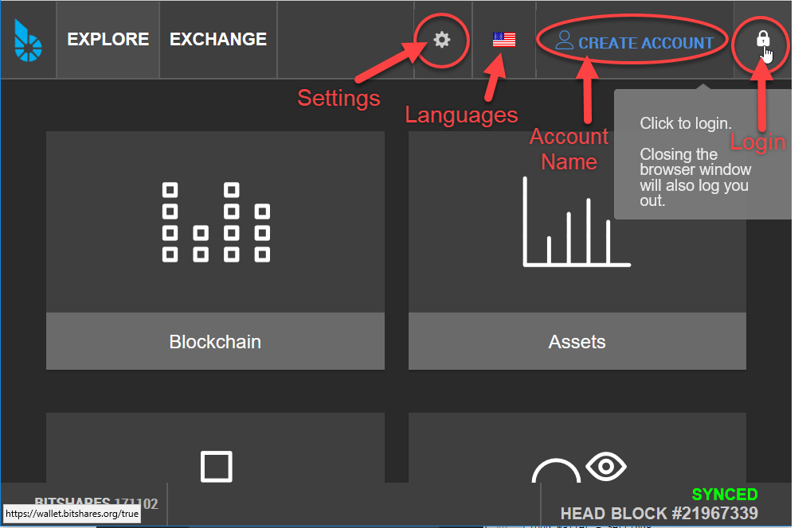
	
|  

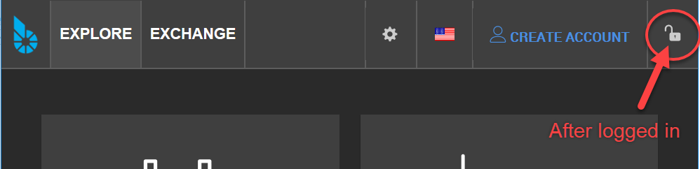
	
|

.. _bitshares-settings-imgs:

Cloud Wallet - Settings
-----------------------

.. _wallet-settings-login-mode:  
  

General
^^^^^^^^^

Cloud Wallet Login Mode
~~~~~~~~~~~~~~~~~~~~~~~

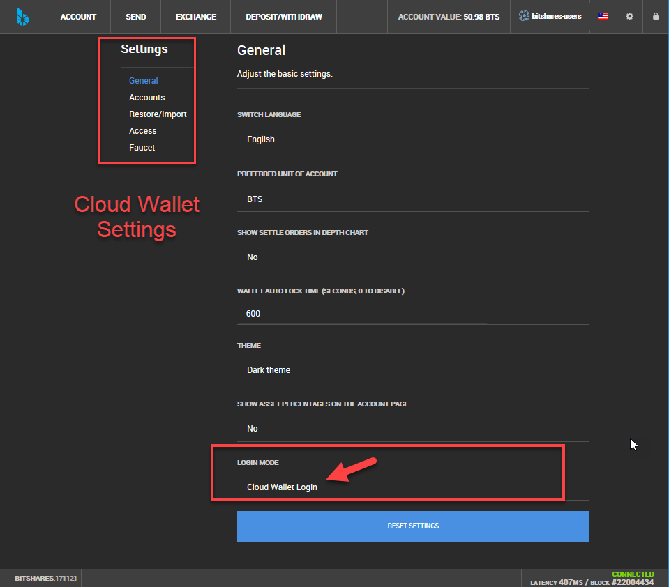
		
|

Rreferred Unit of Account
~~~~~~~~~~~~~~~~~~~~~~~~~~

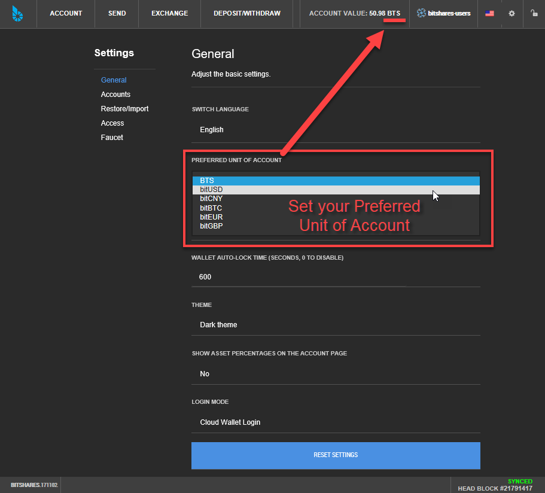

Accounts
^^^^^^^^^	

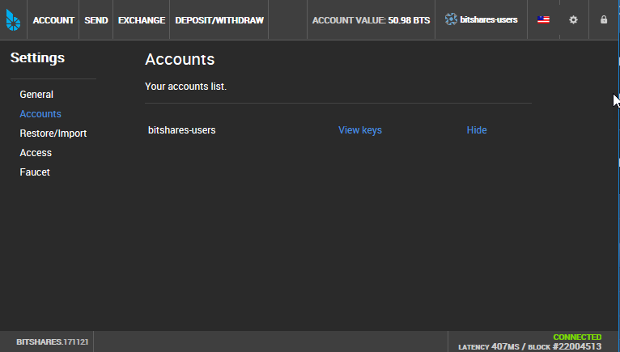

|

Restore/Import
^^^^^^^^^^^^^^		
:ref:`* Learn more... <restore-import-2>`

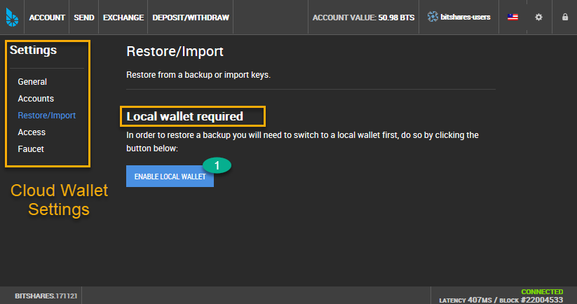
		
|

Access
^^^^^^	

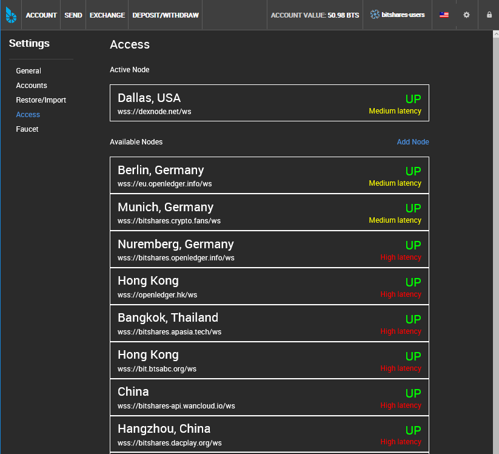

|

Faucet
^^^^^^^^^^	

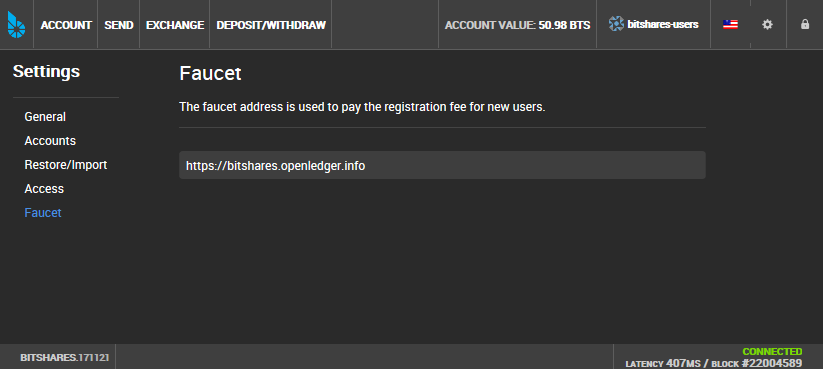

|
		
.. _bitshares-settings-imgs2:		
		
Local Wallet - Settings 
---------------------------

General	
^^^^^^^^^^^^^^^^^^^^^

.. _local-wallet-login-mode:

Local Wallet Login Mode
~~~~~~~~~~~~~~~~~~~~~~~~

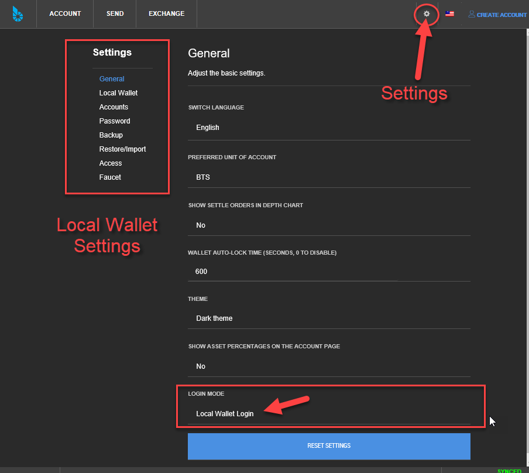

|

.. _settings-new-local-wallet:

Local Wallet	
^^^^^^^^^^^^^^^^^^

How to Create New Local Wallet
~~~~~~~~~~~~~~~~~~~~~~~~~~~~~~

1.Click **'NEW LOCAL WALLET'**

.. image:: setting-local-wallet-active.png
        :alt: Local Wallet
        :width: 650px
        :align: center

|

2. Set your password and click **'CREATE NEW LOCAL WALLET'**

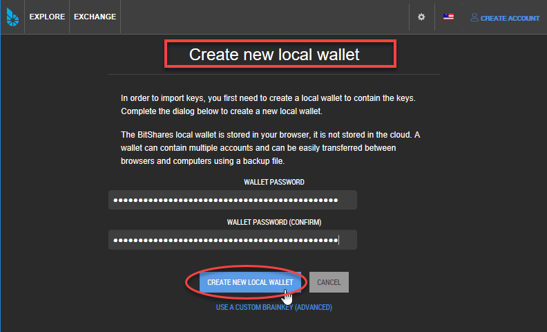
		
|

3. (Advanced) Use a Custom Brainkey 

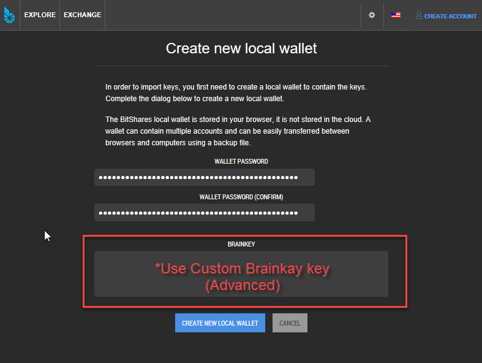
		
|

4. Done!

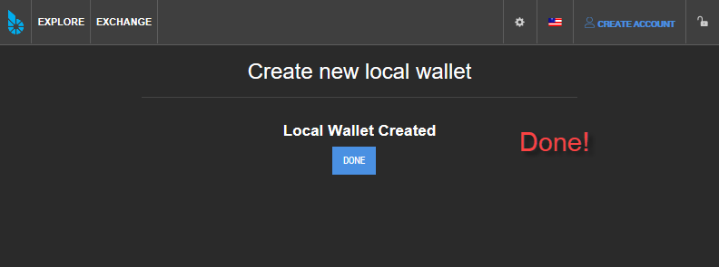
		
					
		
		
		
|
Accounts	
---------------	

.. image:: wallet-setting-account2.png
        :alt: Account
        :width: 650px
        :align: center

|
Password	
-------------

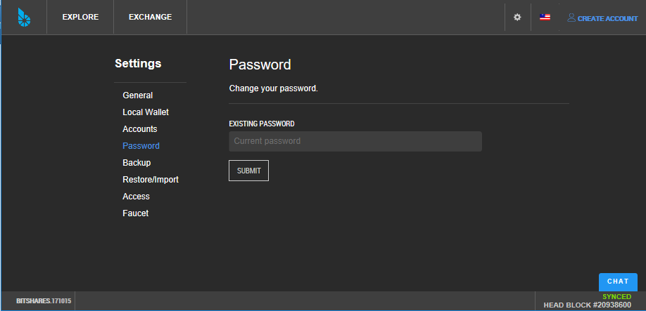

|

Backup		
---------------

:ref:`* Learn more... <security>`

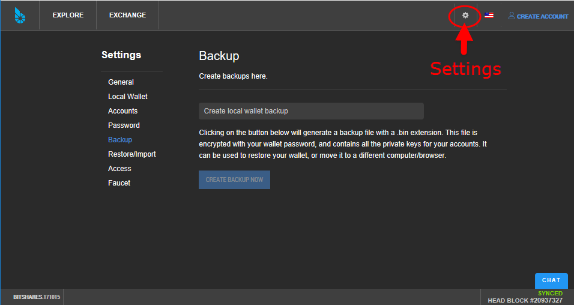
	
|
Restore/Import	
-----------------------
:ref:`* Learn more... <restore-import-3>`

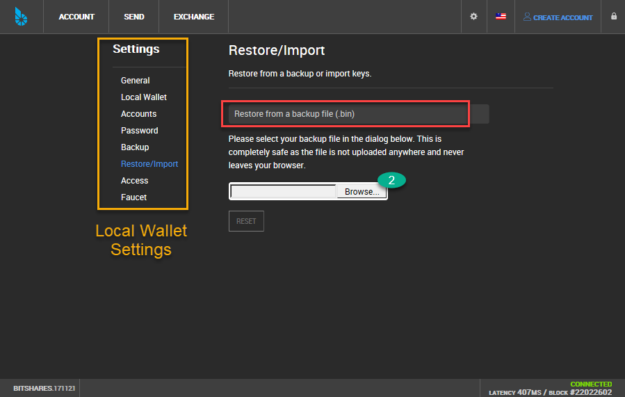
		

|
Faucet
---------------

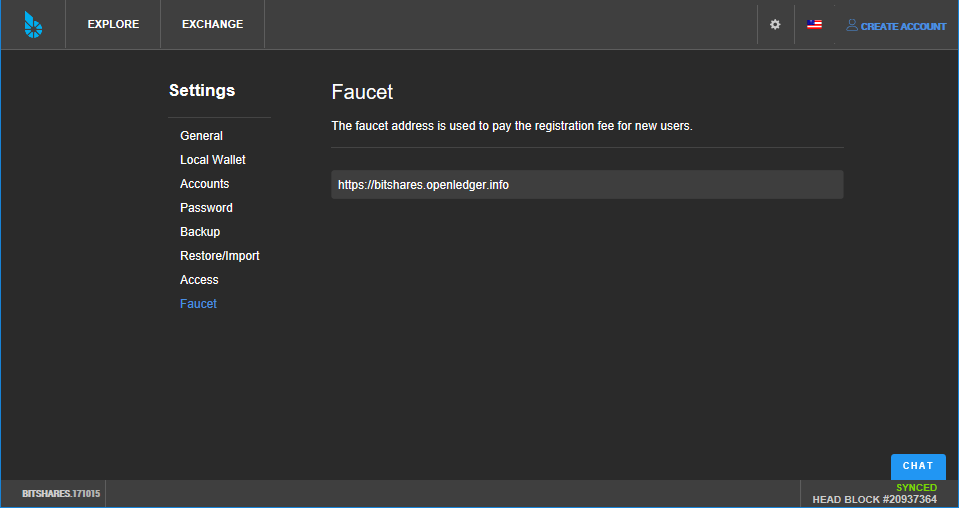
   
   
|   
		
|

